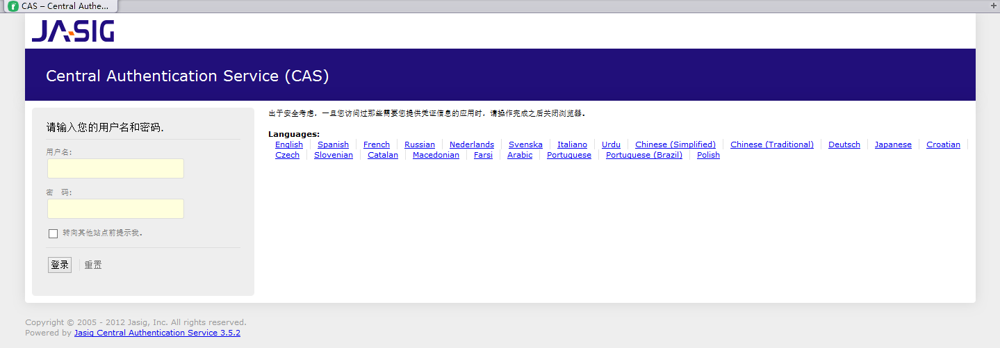
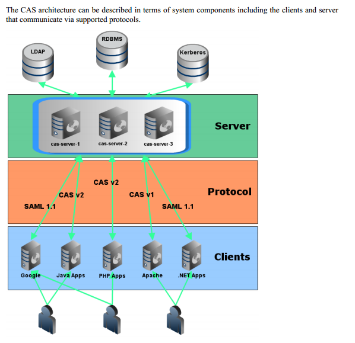
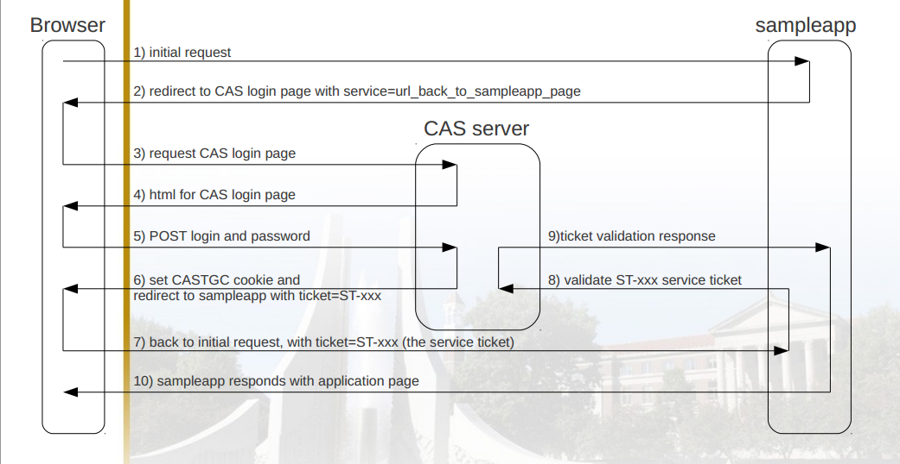
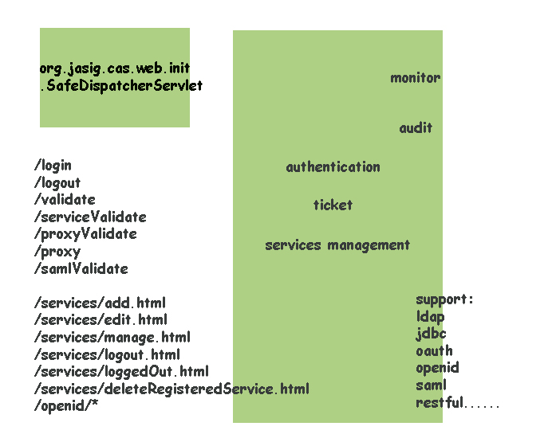
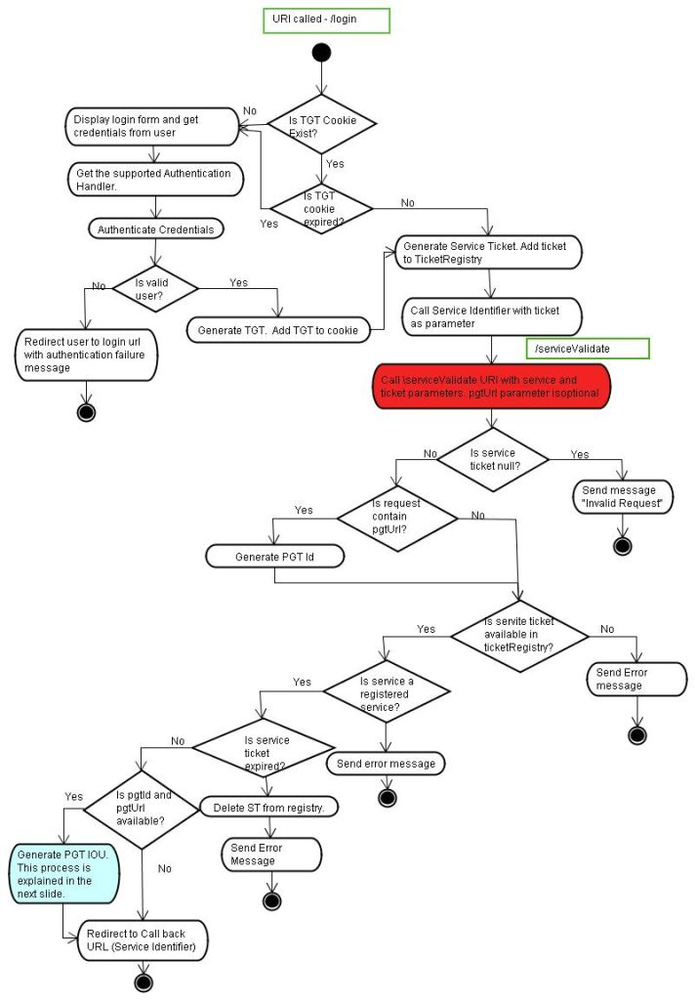
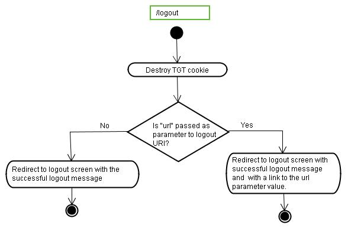

## SSO (single sign on)
Single sign-on (SSO) is mechanism whereby a single action of user authentication and authorization can permit a user to access all computers and systems where he has access permission, without the need to enter multiple passwords.  

###### 单点登录简介
> Single sign-on (SSO) is a property of access control of multiple related, but independent software systems. 
> With this property a user logs in once and gains access to all systems without being prompted to log in 
> again at each of them. Conversely, Single sign-off is the property whereby a single action of signing out 
> terminates access to multiple software systems.  

###### 单点登录实现方案
略

###### List of single sign-on implementations
* CAS / Central Authentication Service：Protocol and SSO server/client implementation  
* OpenAM：Access management, entitlements and federation server platform，continue to develop and support OpenSSO from Sun now that Oracle has chosen to discontinue development on the project
* Facebook connect：Facebook SSO to third parties enabled by Facebook  
* HP IceWall SSO：Web and Federated Single Sign-On Solution  
* JBoss SSO：Federated Single Sign-on  

## JASIG CAS‎ 单点登录

GitHub Source:[https://github.com/Jasig/cas](https://github.com/Jasig/cas)  
CAS download:[http://www.jasig.org/cas/download](http://www.jasig.org/cas/download)  

* An open and well-documented protocol
* An open-source Java server component
* A library of clients for Java, .Net, PHP, Perl, Apache, uPortal, and others
Integrates with uPortal, Sakai, BlueSocket, TikiWiki, Mule, Liferay, Moodle and others
* Community documentation and implementation support
* An extensive community of adopters

## CAS Protocol (Central Authentication Service协议)

* "Client" refers to the end user and/or the web browser.
* "Server" refers to the Central Authentication Service server.
* "Service" refers to the application the client is trying to access.
* "Back-end service" refers to the application a service is trying to access on behalf of a client. This can also be referred to as the "target service"，such as a database server, that does not have its own HTTP interface but communicates with a web application.

###### Cas server webapp部署
1.tomcat SSL 配置[http://tomcat.apache.org/tomcat-7.0-doc/ssl-howto.html](http://tomcat.apache.org/tomcat-7.0-doc/ssl-howto.html)  

    Create a keystore file to store the server's private key and self-signed certificate by executing the following command:  

        %JAVA_HOME%\bin\keytool -genkey -alias tomcat -keyalg RSA

    输入密码和一些信息，这样会在用户根目录下生成.keystore文件  

    server.xml 配置

        <Connector port="8443" protocol="HTTP/1.1" SSLEnabled="true"
            maxThreads="150" scheme="https" secure="true"
            keystoreFile="C:/Users/Sayi/.keystore" keystorePass="123456"
            clientAuth="false" sslProtocol="TLS" />  

2.部署cas-server-webapp-3.5.2.war  
将此war包部署到tomcat下改名为cas.war,启动tomcat，访问

    https://localhost:8443/cas

成功看到登录页面后，由于缺省机制使用
SimpleTestUsernamePasswordAuthenticationHandler.java来认证，所以帐号名和密码相同且不为空即可登录成功。

###### JASIG CAS‎ 票根TGT、ST、LT(PT、PGT、PGTIOU、TGTIOU)
Ticket-granting ticket (TGT):  
在用户通过/login认证帐号和，密码成功后，cas server生成的。TGT构成了对cas 服务的访问。它是一个随机字符串，以TGT-为前缀。cas server生成TGT后会在HTTP cookie中增加TGT的id，默认名称问CASTGC，用来自动登录其它系统，因此在CAS Server中，有着存储注册TGT的机制。  
Ticket-granting Cookie (TGC):  
建立单点登录会话，生成TGT后产生的。  
Service Ticket (ST):  
当CAS URL包含service参数时，认证授权产生TGT后，将生成ST传递给client，client使用这个票根进行校验然后获得用户名，通常以ST-为前缀，默认有效期为使用一次。  
Login Ticket (LT):   
在访问/login页面时产生，在页面中作为一个隐藏域进行表单提交，为了防止the replaying of credentials due to bugs in web browsers.通常以LT-为前缀。

###### JASIG CAS‎ 原理机制
首先通过一张图来了解一下cas的架构：  
  
整个请求的流程见下图：  
  
代码架构图如下：  

###### JASIG CAS‎ 登录、登出流程flow
这幅图完整的介绍了登录流程,这幅图默认是在CAS URL中包含service参数，如果不包含service参数，则不会生成ST。  
  

    注意：在默认的CAS server webapp中，对于没有service参数的login流程，在判断存在TGT cookie后，并未进行TGT是否有效的检查，直接导向登录成功页面，不放在登录时，增加cookie CASTGC，值任意试试

登出流程：  
  
When user wants to logout from a service, he has to call /logout URI. CAS destroys the ticket-granting cookie and checks if the /logout URI contains parameter url. If parameter “url” is available, a successful logout message is displayed with a link to the request parameter url value else only successful logout message is displayed.

###### JASIG CAS‎ 授权Services Management 
主要判断什么service可以访问，并对ST进行校验，ST是通过/serviceValidate服务来校验。  
默认的服务是存在内存中的，我们可以使其持久化。
    <bean
        id="serviceRegistryDao"
        class="org.jasig.cas.services.InMemoryServiceRegistryDaoImpl">

###### JASIG CAS‎ 票根注册TicketRegistry
cas在TicketRegistry组件中提供了很多方式来存储Tickets。
EhcacheTicketRegistry

## JASIG CAS‎ 安全
###### JASIG CAS‎ 安全策略-Ticket Expiration Policy
由于CAS使用票根来实现cas协议，所以票根的行为决定了安全的许多方面。默认的票根过期策略为：  
* Ticket-granting tickets (TGT) that expire after more than 2 hours of inactivity.  
* One-time-use service tickets (ST) that must be validated within 5 minutes.  

###### JASIG CAS‎ 增加安全
1、SSL还是非SSL  
CAS仅仅在安全连接下发送CASTGC cookie，我们可以通过配置 p:cookieSecure="false"来支持在普通的HTTP下发送cookie，但是这并不推荐。

    <bean id="ticketGrantingTicketCookieGenerator" class="org.jasig.cas.web.support.CookieRetrievingCookieGenerator"
        p:cookieSecure="false"
        p:cookieMaxAge="-1"
        p:cookieName="CASTGC"
        p:cookiePath="/cas" />

2、service 限制  
理想的解决方案是在Services Management中定义每一个service。

3、通过迷惑来增加安全  
通过一些迷惑来隐藏你正在使用cas的事实。  

* The default CAS war name
* Any Jasig logos (though hey, feel free to let us know that you're using it, and contribute back!)
* CAS version information on public-facing pages
* Overriding error pages that you may not think matter since CAS never goes down!

4、Secure the Server  
All the usual recommendations/best practices for securing servers apply here.  

5、Enable Throttling、Enable Auditing

## JASIG CAS‎ 认证管理
CAS初始默认的认证处理机制为SimpleTestUsernamePasswordAuthenticationHandler,显然我们需要自己的认证方案。
通常在大规模的单点登录系统中，用户存储在LDAP服务器中是个非常好的选择，cas提供了ldap的支持插件，同样，对于DB认证的方案，cas提供了jdbc的支持插件。下面的示例以一个Properties文件存储帐号和密码来进行认证，用来说明有关的配置：  

首先，新建认证的处理类：  

    package cn.youthplus.cas.authentication.handler;

    import java.io.FileNotFoundException;
    import java.io.IOException;
    import java.io.InputStream;
    import java.util.Properties;

    import org.jasig.cas.authentication.handler.AuthenticationException;
    import org.jasig.cas.authentication.handler.support.AbstractUsernamePasswordAuthenticationHandler;
    import org.jasig.cas.authentication.principal.UsernamePasswordCredentials;

    public class PropertiesAuthenticationHandler extends
            AbstractUsernamePasswordAuthenticationHandler {

        private Properties properties = new Properties();;

        public PropertiesAuthenticationHandler(String fileName) {
            log.warn(this.getClass().getName()
                    + " is only to be used in a testing environment.  NEVER enable this in a production environment.");

            InputStream fis;
            try {
                fis = getClass().getResourceAsStream(fileName);
                properties.load(fis);

            } catch (FileNotFoundException e) {
                log.error("Properties file cannot be found:" + fileName);
            } catch (IOException e) {
                log.error("Load Properties file failed:" + fileName);
            }

        }

        @Override
        protected boolean authenticateUsernamePasswordInternal(
                UsernamePasswordCredentials credentials)
                throws AuthenticationException {
            final String username = credentials.getUsername();
            final String password = credentials.getPassword();

            if (null != properties.getProperty(username)
                    && properties.getProperty(username).equals(password)) {
                return true;
            }
            return false;
        }

    }

然后，在deployerConfigContext.xml中配置这个认证处理类：

    <!-- <bean 
        class="org.jasig.cas.authentication.handler.support.SimpleTestUsernamePasswordAuthenticationHandler" /> -->
     <bean id="propertiesAuthenticationHandler"
        class="cn.youthplus.cas.authentication.handler.PropertiesAuthenticationHandler" >
        <constructor-arg index="0" value="/authentic.properties" />
    </bean>

最后，在classes目录下新建文件authentic.properties，内容如下：  

    sayi=123456

所以，对于认证，我们可以做的多得多。

###### JASIG CAS‎与jdbc
BindModeSearchDatabaseAuthenticationHandler\QueryDatabaseAuthenticationHandler
###### JASIG CAS‎与Ldap
FastBindLdapAuthenticationHandler\BindLdapAuthenticationHandler
## JASIG CAS‎与OAuth2 server
###### OAuth support
CAS3.5.x提供了oauth的支持，包括客户端和服务端，cas-server-support-oauth依赖架包
> scribe-1.3.5.jar  
> scribe-up-1.2.0.jar  
> jackson-core-2.3.0.jar,jackson-databind-2.3.0.jar。

CAS默认提供了三个服务：  
* /oauth2.0/authorize  
* Input GET parameters required : client_id and redirect_uri.  
* /oauth2.0/accessToken    
* Input GET parameters required : client_id, redirect_uri, client_secret and code.  
* /oauth2.0/profile    
* Input GET parameter required : access_token.   

######关于接入的一些背景：
1.cas的web登录访问路径为https://cas.sayi.com:8443/cas/login  
2.回调地址为http://www.doubannote.org/(虚拟地址，实际不存在)  
3.client_Id为key  
4.client_secret为secret  
5.应用名称为DoubanNote  
6.核心类为org.jasig.cas.support.oauth.web.OAuth20WrapperController  

下面配置cas server支持oauth2 server，我们从oauth2 client向cas接入为步骤来分析每一步的配置：  
##  step1. 应用配置，获得client_id和client_secret
在成熟的系统中，通常提供页面供用户申请应用，然后提供用户client_id和client_secret，并允许用户配置回调地址，那么oauthserver端(即CAS Server)首先考虑的就是需要持久化这些配置。默认在文件deployerConfigContext.xml的serviceRegistryDao中配置应用服务，实际使用中，我们可以将申请的应用信息存储在数据库中：  

    <bean
        id="serviceRegistryDao"
        class="org.jasig.cas.services.InMemoryServiceRegistryDaoImpl">
            <property name="registeredServices">
                <list>
                    <bean class="org.jasig.cas.services.RegisteredServiceImpl">
                        <property name="id" value="1" />
                        <property name="name" value="HTTP" />
                        <property name="description" value="oauth wrapper callback url" />
                        <property name="serviceId" value="${server.prefix}/oauth2.0/callbackAuthorize" />
                    </bean>
                   <bean class="org.jasig.cas.services.RegisteredServiceImpl">
                    <property name="id" value="2" />
                    <property name="name" value="key" />
                    <property name="description" value="secret" />
                    <property name="serviceId" value="http://www.doubannote.org/" />
                    <property name="theme" value="DoubanNote" />
                  </bean>
                  ......
如代码所示，我们新注册了两个bean，关于应用的配置在第二个bean中，name为client_id，description为client_secret，serviceId为回调地址，theme为应用名称。  
关于第一个bean的用途将在下面介绍。  

## step2. Oauth client 构造url，获取authorization_code
通常客户端构造的url可能如下(参数可以参照标准的oauth2 protocol，但是不同的oauth server通常提供了自己的标准)：  

    https://cas.sayi.com:8443/cas/oauth2.0/authorize?client_id=key&redirect_uri=http://www.doubannote.org/&response_type=code
在这里就要求cas server能对/oauth2.0/authorize的url进行处理,那么就需要配置映射，在web.xml中配置如下：  

    <servlet-mapping>
        <servlet-name>cas</servlet-name>
        <url-pattern>/oauth2.0/*</url-pattern>
    </servlet-mapping>

在cas-servlet.xml中配置映射：  

    <prop key="/oauth2.0/*">oauth20WrapperController</prop>
    ...
    ...
    <bean id="oauth20WrapperController"
        class="org.jasig.cas.support.oauth.web.OAuth20WrapperController"
        p:loginUrl="${server.prefix}/login" p:servicesManager-ref="servicesManager"
        p:ticketRegistry-ref="ticketRegistry" p:timeout="7200" />
如上配置了之后，我们获取授权码的链接会转向login页面，此时的service地址就是step1中配置的第一个bean的serviceId，通过这个默认提供的地址间接的获取到ST。

    https://cas.sayi.com:8443/cas/login?service=https%3A%2F%2Fcas.sayi.com%3A8443%2Fcas%2Foauth2.0%2FcallbackAuthorize

认证成功之后，就会携带值为ST的参数跳转到callbackAuthorize页面，此时生成的ST即为授权码，回调地址、服务名称通过session传递过来。

    https://cas.sayi.com:8443/cas/oauth2.0/callbackAuthorize?ticket=ST-5-ywMLFaXQFnDeFI7erFy7-cas.sayi.com
默认授权码只能使用一次，且有效时间为10s，可以通过票根过期策略进行配置时间。

## step3. 授权码交换access_token
构造的URL如下：  

    https://cas.sayi.com:8443/cas/oauth2.0/accessToken?client_id=key&client_secret=secret&grant_type=authorization_code&redirect_uri=http://www.doubannote.org/&code=ST-1-3jLuZnhcAvLiLdy7R6ft-cas.sayi.com

    access_token=TGT-2-qWkLyEbeoby043q05p5GHXfBg7qtdPZjEUhfemgg3UKbxAyB5s-cas.sayi.com&expires=7143
通过返回的值可以获得access_token.

## step4. 根据access_token获取用户信息
构造URL如下：  

    https://cas.sayi.com:8443/cas/oauth2.0/profile?access_token=TGT-1-gn3p9EMfFEajKOJ9DdNqd2PefJdIbIeXuESyzU4EctMtBqITRG-cas.sayi.com

    {
    "id":"sayi",
        "attributes":[
            {
                "uid":"uid"
            },
            {
                "eduPersonAffiliation":"eduPersonAffiliation"
            },
            {
                "groupMembership":"groupMembership"
            }
        ]
    }
###### 总结
cas server支持oauth2 server，无非就是考虑对/authorize、/accessToken、/profile的请求的处理，在服务端进行应用配置后，对接入的应用进行校验，比如回调地址、client_secret等。在与cas server的融合中，主要就是cas认证与/authorize的融合。在这里使用的是callbackAuthorize的方式，cas默认提供了/oauth2.0/callbackAuthorize的service地址，通过此地址cas认证成功之后生成ST，此值即为授权码，传递给应用的回调地址即可。  
总体来说oauth2的支持在cas3.5.x中并不完善，而且OAuth2的实现也不是标准的，对于3.5.x版本我们需要扩展OAuth20WrapperController来进一步融合oauth2 protocol。

###### JASIG CAS‎与ehcache

###### 扩展CAS之定制化页面
cas的默认页面在目录WEB-INF/view/jsp/default/ui下，登录页面为casLoginView.jsp，引入了top.jsp和bottom.jsp,在页面中，区别了PC访问和手机访问的显示方式,当且是手机访问方式且加载到手机的样式css文件将显示： `${not empty requestScope['isMobile'] and not empty mobileCss}` 。  
  
登录成功后，设定的方案是进入个人中心页面。

###### 扩展CAS之验证码安全
这里采用官方推荐的Jcaptcha1.0，虽然貌似已经不再开发了。通过官方资料，我们创建CaptchaImageCreateController控制器来生成图片，通过高度可配置的xml来进行配置。
  
  
  
以下通过每次都必须输入验证码来演示如何扩展。
1 创建验证码图片生成控制器
2 修改login-webflow的流程，加入验证码校验
3 实现验证码校验

###### 扩展CAS之多帐号选择
###### 扩展CAS之前端校验
###### 扩展CAS之头像
###### 扩展CAS之桌面客户端的单点登录
###### Cas server 源码开发
调试：  
在cas3.5.2中新增类terminateWebSessionListener，在cas-servlet中配置，这个监听器是使得在web flow结束时使session过期，这就在调试的时候总是会遇到Cannot create a session after the response has been committed的异常。解决办法是1、注释掉这个监听器  

    <!-- <webflow:flow-execution-listeners>
      <webflow:listener ref="terminateWebSessionListener" />
    </webflow:flow-execution-listeners> -->
2.提高死亡时间值（调试中不推荐此做法）  

    <bean id="terminateWebSessionListener" class="org.jasig.cas.web.flow.TerminateWebSessionListener"
      p:serviceManagerUrl="${cas.securityContext.serviceProperties.service}" p:timeToDieInSeconds="5"/>
基础知识
Spring MVC
Spring Web Flow
Spring Security

## 附录
###### public apis

    Below, you will find a complete listing of the public APIs for CAS. Public APIs will not change between minor revisions (i.e. 3.0.x) but may change during major revisions.

    org.jasig.cas.CentralAuthenticationService
    org.jasig.cas.authentication.handler.support.AbstractUsernamePasswordAuthenticationHandler
    org.jasig.cas.authentication.handler.AuthenticationHandler
    org.jasig.cas.authentication.handler.PasswordEncoder
    org.jasig.cas.authentication.principal.Credentials
    org.jasig.cas.authentication.principal.CredentialsToPrincipalResolver
    org.jasig.cas.authentication.principal.Principal
    org.jasig.cas.authentication.principal.Service
    org.jasig.cas.authentication.principal.UsernamePasswordCredentials
    org.jasig.cas.authentication.Authentication
    org.jasig.cas.authentication.AuthenticationManager
    org.jasig.cas.authentication.AuthenticationMetaDataPopulator
    org.jasig.cas.ticket.proxy.ProxyHandler
    org.jasig.cas.ticket.registry.TicketRegistry
    org.jasig.cas.ticket.registry.RegistryCleaner
    org.jasig.cas.ticket.registry.AbstractTicketRegistry
    org.jasig.cas.ticket.ExpirationPolicy
    org.jasig.cas.util.UniqueTicketIdGenerator
    org.jasig.cas.validation.ValidationSpecification
    org.jasig.cas.validation.Assertion
    org.jasig.cas.web.bind.CredentialsBinder

