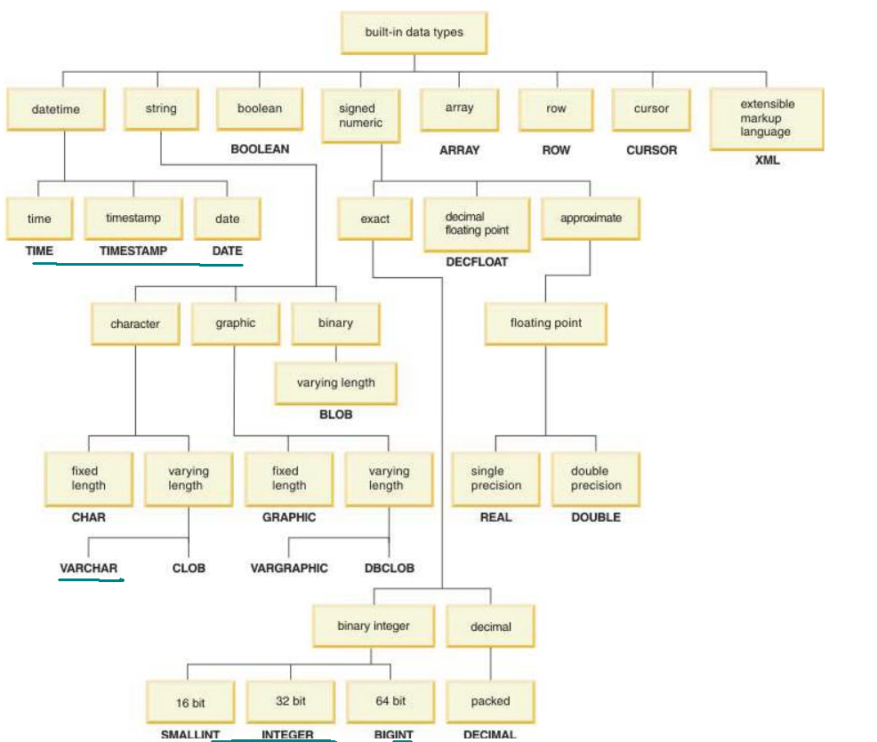
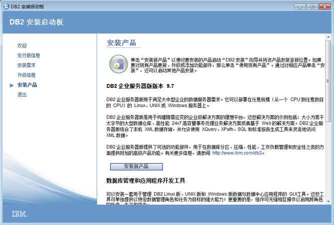
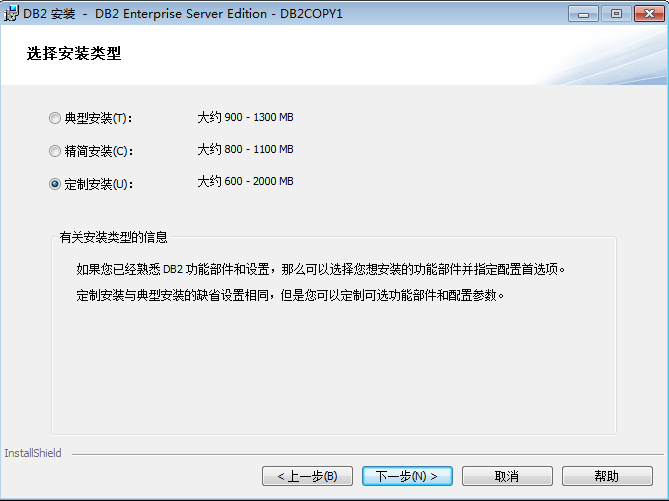
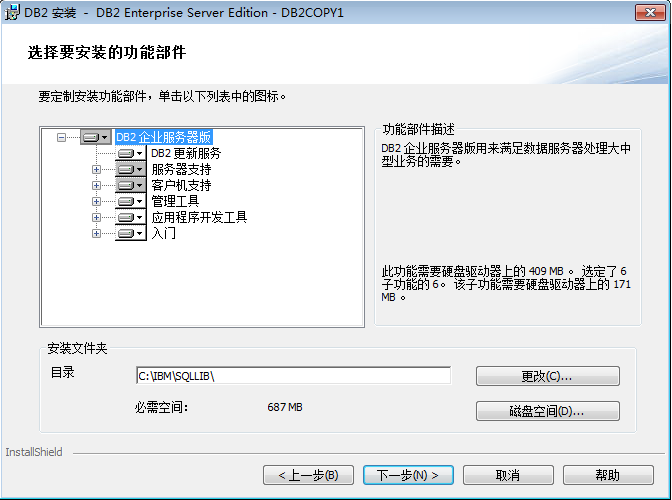
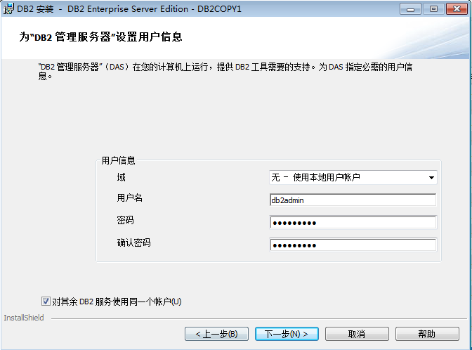
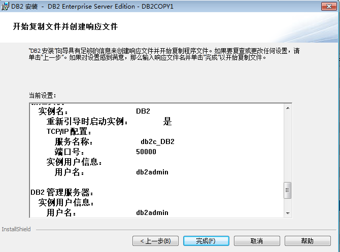

# DB2
## 数据库管理

###### 实例
在Windows系统中，安装时默认创建一个实例名称为“DB2”(linux下是db2inst1)，一个数据库服务器上可以创建多个用于不同目的实例，所有这些实例都是相互
独立的，可以使用命令`db2 set db2instance=instance_name`来切换实例。实例层上常用的DB2命令：

	db2ilist  显示系统您当前的所有实例清单
	db2 get instance  显示当前运行的实例
	db2start  启动当前实例
	db2stop  停止当前实例
	db2 force applications all  关闭所有连接，确保没有连接
	db2icrt instance_name 创建一个新的实例
	db2idrop instance_name  删除一个实例

	C:\IBM\SQLLIB\BIN>db2icrt DB_TEST
	DB20000I  DB2ICRT 命令成功完成。

	C:\IBM\SQLLIB\BIN>db2ilist
	DB_TEST
	DB2

	C:\IBM\SQLLIB\BIN>db2 get instance

	 当前数据库管理器实例是：DB2

	C:\IBM\SQLLIB\BIN>set db2instance = db_test

###### 数据库
随着数据库的创建，有几个默认的对象也同时被创建：表空间，表，缓冲池，日志文件。因为
创建这些对象需要一点时间，所以执行数据库创建过程需要几分钟。
数据库层的命令/SQL 语句：

	db2 list db directory  显示所有已创建的数据库
	db2 create database(db)  创建一个新的数据库
	db2 drop database  删除一个数据库
	db2 connect to <database_name> user [username] using [pwd] 连接数据库

	C:\IBM\SQLLIB\BIN>db2 list db directory
	SQL1057W  系统数据库目录为空。  SQLSTATE=01606

	C:\IBM\SQLLIB\BIN>db2 create db imp5db
	DB20000I  CREATE DATABASE 命令成功完成。

	C:\IBM\SQLLIB\BIN>db2 list db directory

	 系统数据库目录

	 目录中的条目数 = 1

	数据库 1 条目：

	 数据库别名                      = IMP5DB
	 数据库名称                               = IMP5DB
	 本地数据库目录                  = C:
	 数据库发行版级别                = d.00
	 注释                            =
	 目录条目类型                    = 间接
	 目录数据库分区号                  = 0
	 备用服务器主机名                =
	 备用服务器端口号                =
	C:\IBM\SQLLIB\BIN>db2 connect to imp5db user db2admin [using  password]

	   数据库连接信息

	 数据库服务器         = DB2/NT 9.7.1
	 SQL 授权标识         = DB2ADMIN
	 本地数据库别名       = IMP5DB

###### 表
所有的 DB 数据库对象标识名都可以一分为二，模式就是此名字的前半部分。
<模式名>.<对象名>，一个标识名称必须是独一无二的。在没有指定模式的情况下连接数据库并创建或引用数据库对
象时，DB2 使用用户 ID 作为模式名称来连接数据库。  

	db2 list tables [for user] 列出所有用户表
	db2 list tables for system  列出所有系统表
	db2 describe table table_name  列出表结构
	db2 create table/create view/create index  分别创建表，视图，和索引

	C:\IBM\SQLLIB\BIN>db2 create table test(id varchar(32),username varchar(32))
	DB20000I  SQL 命令成功完成。

	C:\IBM\SQLLIB\BIN>db2 list tables 　　
							     
	表/视图				 模式		类型  创建时间
	------------------------------- --------------- ----- --------------------------

	TEST                            DB2ADMIN        T     2013-11-19-10.23.11.410002

	1 条记录已选择。

	C:\IBM\SQLLIB\BIN>db2 describe table test

					数据类型                      列
	列名                             模式       数据类型名称      长     小数位
	 NULL
	------------------------------- --------- ------------------- ---------- ----- -
	-----
	ID                              SYSIBM    VARCHAR                     32     0
	是
	USERNAME                        SYSIBM    VARCHAR                     32     0
	是

	2 条记录已选择。

###### 帮助

db2 ? db2start 查看命令帮助

db2 ? 22001 查看错误码信息sqlstate

## DB2 基本SQL、数据类型
  
#### 数据类型主要包括以下三个：  
###### String data types
* CHARACTER(n) 	Fixed-length character strings with a length of n bytes. n must be greater than 0 and not greater than 255. The default length is 1.

* VARCHAR(n) 	Varying-length character strings with a maximum length of n bytes. n must be greater than 0 and less than a number that depends on the page size of the table space. The maximum length is 32704.

* CLOB(n) 	Varying-length character strings with a maximum of n characters. n cannot exceed 2 147 483 647. The default length is 1.

* GRAPHIC(n) 	Fixed-length graphic strings that contain n double-byte characters. n must be greater than 0 and less than 128. The default length is 1.

* VARGRAPHIC(n) 	Varying-length graphic strings. The maximum length, n, must be greater than 0 and less than a number that depends on the page size of the table space. The maximum length is 16352.

* DBCLOB(n) 	Varying-length strings of double-byte characters with a maximum of n double-byte characters. n cannot exceed 1 073 741 824. The default length is 1.

* BINARY(n) 	Fixed-length or varying-length binary strings with a length of n bytes. n must be greater than 0 and not greater than 255. The default length is 1.

* VARBINARY(n) 	Varying-length binary strings with a length of n bytes. The length of n must be greater than 0 and less than a number that depends on the page size of the table space. The maximum length is 32704.

* BLOB(n) 	Varying-length binary strings with a length of n bytes. n cannot exceed 2 147 483 647. The default length is 1.

###### Numeric data types
* SMALLINT 	Small integers. A small integer is binary integer with a precision of 15 bits. The range is -32768 to +32767.

* INTEGER or
INT
	Large integers. A large integer is binary integer with a precision of 31 bits. The range is -2147483648 to +2147483647.

* BIGINT 	Big integers. A big integer is a binary integer with a precision of 63 bits. The range of big integers is -9223372036854775808 to +9223372036854775807.

* DECIMAL or
NUMERIC
	A decimal number is a packed decimal number with an implicit decimal point. The position of the decimal point is determined by the precision and the scale of the number. The scale, which is the number of digits in the fractional part of the number, cannot be negative or greater than the precision. The maximum precision is 31 digits.

All values of a decimal column have the same precision and scale. The range of a decimal variable or the numbers in a decimal column is -n to +n, where n is the largest positive number that can be represented with the applicable precision and scale. The maximum range is 1 - 1031 to 1031 - 1.

* DECFLOAT 	A decimal floating-point value is an IEEE 754r number with a decimal point. The position of the decimal point is stored in each decimal floating-point value. The maximum precision is 34 digits.

The range of a decimal floating-point number is either 16 or 34 digits of precision; the exponent range is respectively 10-383 to 10+384 or 10-6143 to 10+6144.

* REAL 	A single-precision floating-point number is a short floating-point number of 32 bits. The range of single-precision floating-point numbers is approximately -7.2E+75 to 7.2E+75. In this range, the largest negative value is about -5.4E-79, and the smallest positive value is about 5.4E-079.

* DOUBLE 	A double-precision floating-point number is a long floating-point number of 64-bits. The range of double-precision floating-point numbers is approximately -7.2E+75 to 7.2E+75. In this range, the largest negative value is about -5.4E-79, and the smallest positive value is about 5.4E-079.

###### Date, time, and timestamp data types。
Although storing dates and times as numeric values is possible, using datetime data types is recommended. The datetime data types are DATE, TIME, and TIMESTAMP.

* DATE 	A date is a three-part value representing a year, month, and day in the range of 0001-01-01 to 9999-12-31.

* TIME 	A time is a three-part value representing a time of day in hours, minutes, and seconds, in the range of 00.00.00 to 24.00.00.

* TIMESTAMP 	Start of changeA timestamp is a seven-part value representing a date and time by year, month, day, hour, minute, second, and microsecond, in the range of 0001-01-01-00.00.00.000000000 to 9999-12-31-24.00.00.000000000 with nanosecond precision. Timestamps can also hold timezone information.End of change

#### 基本sql
###### create table
###### drop table
###### insert
###### update
###### select
###### delete

## DB2 内置函数
参见附录。
###### 常用函数
* COUNT
* MAX、MIIN
* SUM
* CHAR
* DATE
* DAY
* DAYOFMONTH
* DAYOFWEEK
* DAYOFYEAR
* LENGTH
* TO_CHAR
* TO_DATE
* SUBSTR
* to_number
* POSSTR
* quarter

## DB2 Expressions表达式
cast

## DB2 特殊寄存器
一个特殊的寄存器是一个存储区域，一个应用程序定义的DB2?和用于存储信息，可以在SQL语句中引用。
* Datetime special registers  

    CURRENT DATE
    CURRENT TIME
    CURRENT TIMESTAMP
    SELECT current date FROM sysibm.sysdummy1 
    SELECT current time FROM sysibm.sysdummy1 
    SELECT current timestamp FROM sysibm.sysdummy1

    YEAR (current timestamp) 
    MONTH (current timestamp) 
    DAY (current timestamp) 
    HOUR (current timestamp) 
    MINUTE (current timestamp) 
    SECOND (current timestamp) 
    MICROSECOND (current timestamp)

    current date + 1 YEAR 
    current date + 3 YEARS + 2 MONTHS + 15 DAYS 
    current time + 5 HOURS - 3 MINUTES + 10 SECONDS

## 安装DB2(Windows)
###### 运行安装向导
进入安装向导界面：  
  
  
  
  
  
  

###### 验证安装

	C:\IBM\SQLLIB\BIN>db2val
	DBI1379I  db2val 命令正在运行。这可能要花几分钟才能完成。

	DBI1333I  验证 DB2 副本 DB2SAYI 的安装文件成功。

	DBI1339I  验证实例 DB2 成功。

	DBI1343I  成功完成了 db2val 命令。有关详细信息，请参阅日志文件
	C:\Users\sayi\DOCUME~1\DB2LOG\db2val-Mon Nov 18 21_58_29 2013.log。

	C:\IBM\SQLLIB\BIN>db2level
	DB21085I  此实例或安装（适用的实例名："DB2"）使用 "32" 位和级别标识为 "0602010E"
	的 DB2 代码发行版 "SQL10051"。
	参考标记为 "DB2 v10.5.100.64"、"special_31160" 和 "IP23520_31160"，修订包为
	"1"。
	产品使用 DB2 副本名 "DB2SAYI" 安装在 "C:\IBM\SQLLIB" 中。

## 卸载 DB2 产品 (Windows)
此任务提供从 Windows 操作系统中彻底除去 DB2® 产品时需要执行的步骤。仅当不再需要现有 DB2 实例和数据库时才执行此任务。
关于此任务

如果正在卸载缺省 DB2 副本，并且系统上有其他 DB2 副本，请使用 db2swtch 命令在继续卸载之前选择一个新的缺省副本。此外，如果 DB2 管理服务器 (DAS) 正在要除去的那个副本下运行，请将该 DAS 移到不会被除去的副本下。否则，在卸载之后需要使用 db2admin create 命令重新创建 DAS，并且要重新配置 DAS 才能使某些功能起作用。

要从 Windows 中除去 DB2 产品：
过程

    （可选）使用控制中心或 drop database 命令删除所有数据库。确保不再需要这些数据库。如果删除了数据库，那么所有的数据都会丢失。
    停止所有 DB2 进程和服务。可以通过 Windows“服务”面板或者发出 db2stop 命令来完成此任务。如果没有停止 DB2 服务和进程就试图除去 DB2 产品，那么将接收到一条警告，该警告包含内存中保留有 DB2 DLL 的进程和服务的列表。如果您将使用“添加或删除程序”来删除 DB2 产品，那么可以选择是否执行此步骤。
    可以通过以下两个选项来除去 DB2 产品：

    添加/删除程序
        可通过 Windows 的“控制面板”访问它，使用“添加或删除程序”窗口来除去 DB2 产品。有关从 Windows 操作系统中除去软件产品的更多信息，请参阅操作系统的帮助。
    db2unins 命令
        可以从 DB2DIR\bin 目录运行 db2unins 命令以除去 DB2 产品、功能部件或语言。通过使用此命令，在添加了 /p 参数的情况下可以同时卸载多个 DB2 产品。可以使用响应文件并通过 /u 参数来卸载 DB2 产品、功能部件或语言。有关更多信息，请参阅 db2unins 命令主题。

结果
下一步做什么

遗憾的是，使用“控制面板”中的“添加或删除程序”功能或者使用 db2unins /p 命令或 db2unins /u 命令并不是始终都能除去 DB2 产品。仅当上述方法失败时才能尝试使用以下卸载选项。

为了强制除去 Windows 系统中的所有 DB2 副本，运行 db2unins /f 命令。此命令将对系统上的所有 DB2 副本都执行粗暴的强制卸载。除了用户数据（例如，DB2 数据库）之外的所有资源都将被强制删除。在运行带 /f 参数的此命令之前，请参阅 db2unins 命令以了解详细信息。

## 附录：
#### 函数
###### Aggregate functions
An aggregate function receives a set of values for each argument (such as the values of a column) and returns a single-value result for the set of input values. Certain rules apply to all aggregate functions.

   
    AVG
    The AVG function returns the average of a set of numbers.
    CORRELATION
    The CORRELATION function returns the coefficient of the correlation of a set of number pairs.
    COUNT
    The COUNT function returns the number of rows or values in a set of rows or values.
    COUNT_BIG
    The COUNT_BIG function returns the number of rows or values in a set of rows or values. It is similar to COUNT except that the result can be greater than the maximum value of an integer.
    COVARIANCE or COVARIANCE_SAMP
    The COVARIANCE and COVARIANCE_SAMP functions return the covariance (population) of a set of number pairs.
    MAX
    The MAX function returns the maximum value in a set of values.
    MIN
    The MIN function returns the minimum value in a set of values.
    STDDEV or STDDEV_SAMP
    The STDDEV or STDDEV_SAMP function returns the standard deviation (/n), or the sample standard deviation (/n-1), of a set of numbers.
    SUM
    The SUM function returns the sum of a set of numbers.
    VARIANCE or VARIANCE_SAMP
    The VARIANCE function returns the biased variance (/n) of a set of numbers. The VARIANCE_SAMP function returns the sample variance (/n-1) of a set of numbers.
    XMLAGG
    The XMLAGG function returns an XML sequence that contains an item for each non-null value in a set of XML values.

###### Scalar functions
A scalar function can be used wherever an expression can be used. The restrictions on the use of aggregate functions do not apply to scalar functions, because a scalar function is applied to single set of parameter values rather than to sets of values. The argument of a scalar function can be a function. However, the restrictions that apply to the use of expressions and aggregate functions also apply when an expression or aggregate function is used within a scalar function. For example, the argument of a scalar function can be a aggregate function only if a aggregate function is allowed in the context in which the scalar function is used.

    ABS
    The ABS function returns the absolute value of a number.
    ACOS
    The ACOS function returns the arc cosine of the argument as an angle, expressed in radians. The ACOS and COS functions are inverse operations.
    ADD_MONTHS
    The ADD_MONTHS function returns a date that represents expression plus a specified number of months.
    ASCII
    The ASCII function returns the leftmost character of the argument as an integer.
    ASCII_CHR
    The ASCII_CHR function returns the character that has the ASCII code value that is specified by the argument.
    ASCII_STR
    The ASCII_STR function returns an ASCII version of the string in the system ASCII CCSID. The system ASCII CCSID is the SBCS ASCII CCSID on a MIXED=NO system or the MIXED ASCII CCSID on a MIXED=YES system.
    ASIN
    The ASIN function returns the arc sine of the argument as an angle, expressed in radians. The ASIN and SIN functions are inverse operations.
    ATAN
    The ATAN function returns the arc tangent of the argument as an angle, expressed in radians. The ATAN and TAN functions are inverse operations.
    ATANH
    The ATANH function returns the hyperbolic arc tangent of a number, expressed in radians. The ATANH and TANH functions are inverse operations.
    ATAN2
    The ATAN2 function returns the arc tangent of x and y coordinates as an angle, expressed in radians.
    BIGINT
    The BIGINT function returns a big integer representation of either a number or a character or graphic string representation of a number.
    BINARY
    The BINARY function returns a BINARY (fixed-length binary string) representation of a string of any type or of a row ID type.
    Start of changeBITAND, BITANDNOT, BITOR, BITXOR, and BITNOTEnd of change
    The bit manipulation functions operate on the twos complement representation of the integer value of the input arguments. The functions return the result as a corresponding base 10 integer value in a data type that is based on the data type of the input arguments.
    BLOB
    The BLOB function returns a BLOB representation of a string of any type or of a row ID type.
    CCSID_ENCODING
    The CCSID_ENCODING function returns a string value that indicates the encoding scheme of a CCSID that is specified by the argument.
    CEILING
    The CEILING function returns the smallest integer value that is greater than or equal to the argument.
    CHAR
    The CHAR function returns a fixed-length character string representation of the argument.
    CHARACTER_LENGTH
    The CHARACTER_LENGTH function returns the length of the first argument in the specified string unit.
    CLOB
    The CLOB function returns a CLOB representation of a string.
    COALESCE
    The COALESCE function returns the value of the first nonnull expression.
    COLLATION_KEY
    The COLLATION_KEY function returns a varying-length binary string that represents the collation key of the argument in the specified collation.
    COMPARE_DECFLOAT
    The COMPARE_DECFLOAT function returns a SMALLINT value that indicates whether the two arguments are equal or unordered, or whether one argument is greater than the other.
    CONCAT
    The CONCAT function combines two compatible string arguments.
    CONTAINS
    The CONTAINS function searches a text search index using criteria that are specified in a search argument and returns a result about whether or not a match was found.
    COS
    The COS function returns the cosine of the argument, where the argument is an angle, expressed in radians. The COS and ACOS functions are inverse operations.
    COSH
    The COSH function returns the hyperbolic cosine of the argument, where the argument is an angle, expressed in radians.
    DATE
    The DATE function returns a date that is derived from a value.
    DAY
    The DAY function returns the day part of a value.
    DAYOFMONTH
    The DAYOFMONTH function returns the day part of a value. The function is similar to the DAY function, except DAYOFMONTH does not support a date or timestamp duration as an argument.
    DAYOFWEEK
    The DAYOFWEEK function returns an integer, in the range of 1 to 7, that represents the day of the week, where 1 is Sunday and 7 is Saturday. The DAYOFWEEK function is similar to the DAYOFWEEK_ISO function.
    DAYOFWEEK_ISO
    The DAYOFWEEK_ISO function returns an integer, in the range of 1 to 7, that represents the day of the week, where 1 is Monday and 7 is Sunday. The DAYOFWEEK_ISO function is similar to the DAYOFWEEK function.
    DAYOFYEAR
    The DAYOFYEAR function returns an integer, in the range of 1 to 366, that represents the day of the year, where 1 is January 1.
    DAYS
    The DAYS function returns an integer representation of a date.
    DBCLOB
    The DBCLOB function returns a DBCLOB representation of a character string value (with the single-byte characters converted to double-byte characters) or a graphic string value.
    DECFLOAT
    The DECFLOAT function returns a decimal floating-point representation of either a number or a character string representation of a number, a decimal number, an integer, a floating-point number, or a decimal floating-point number.
    Start of changeDECFLOAT_FORMATEnd of change
    The DECFLOAT_FORMAT function returns a DECFLOAT(34) value that is based on the interpretation of the input string using the specified format.
    DECFLOAT_SORTKEY
    The DECFLOAT_SORTKEY function returns a binary value that can be used when sorting DECFLOAT values. The sorting occurs in a manner that is consistent with the IEEE 754R specification on total ordering.
    DECIMAL or DEC
    The DECIMAL function returns a decimal representation of either a number or a character-string or graphic-string representation of a number, an integer, or a decimal number.
    Start of changeDECODEEnd of change
    The DECODE function compares each expression2 to expression1. If expression1 is equal to expression2, or both expression1 and expression2 are null, the value of the result-expression is returned. If no expression2 matches expression1, the value of else-expression is returned. Otherwise a null value is returned.
    DECRYPT_BINARY, DECRYPT_BIT, DECRYPT_CHAR, and DECRYPT_DB
    The decryption functions return a value that is the result of decrypting encrypted data. The decryption functions can decrypt only values that are encrypted by using the ENCRYPT_TDES function.
    DEGREES
    The DEGREES function returns the number of degrees of the argument, which is an angle, expressed in radians.
    DIFFERENCE
    The DIFFERENCE function returns a value, from 0 to 4, that represents the difference between the sounds of two strings, based on applying the SOUNDEX function to the strings. A value of 4 is the best possible sound match.
    DIGITS
    The DIGITS function returns a character string representation of the absolute value of a number.
    DOUBLE_PRECISION or DOUBLE
    The DOUBLE_PRECISION and DOUBLE functions returns a floating-point representation of either a number or a character-string or graphic-string representation of a number, an integer, a decimal number, or a floating-point number.
    DSN_XMLVALIDATE
    The DSN_XMLVALIDATE function returns an XML value that is the result of applying XML schema validation to the first argument of the function. DSN_XMLVALIDATE can validate XML data that has a maximum length of 2 GB - 1 byte.
    EBCDIC_CHR
    The EBCDIC_CHR function returns the character that has the EBCDIC code value that is specified by the argument.
    EBCDIC_STR
    The EBCDIC_STR function returns a string, in the system EBCDIC CCSID, that is an EBCDIC version of the string.
    ENCRYPT_TDES
    The ENCRYPT_TDES function returns a value that is the result of encrypting the first argument by using the Triple DES encryption algorithm. The function can also set the password that is used for encryption.
    EXP
    The EXP function returns a value that is the base of the natural logarithm (e), raised to a power that is specified by the argument. The EXP and LN functions are inverse operations.
    EXTRACT
    The EXTRACT function returns a portion of a date or timestamp, based on its arguments.
    FLOAT
    The FLOAT function returns a floating-point representation of either a number or a string representation of a number. FLOAT is a synonym for the DOUBLE function.
    FLOOR
    The FLOOR function returns the largest integer value that is less than or equal to the argument.
    GENERATE_UNIQUE
    The GENERATE_UNIQUE function returns a bit data character string that is unique, compared to any other execution of the same function.
    GETHINT
    The GETHINT function returns a hint for the password if a hint was embedded in the encrypted data. A password hint is a phrase that helps you remember the password with which the data was encrypted. For example, 'Ocean' might be used as a hint to help remember the password 'Pacific'.
    GETVARIABLE
    The GETVARIABLE function returns a varying-length character-string representation of the current value of the session variable that is identified by the argument.
    GRAPHIC
    The GRAPHIC function returns a fixed-length graphic-string representation of a character string or a graphic string value, depending on the type of the first argument.
    HEX
    The HEX function returns a hexadecimal representation of a value.
    HOUR
    The HOUR function returns the hour part of a value.
    IDENTITY_VAL_LOCAL
    The IDENTITY_VAL_LOCAL function returns the most recently assigned value for an identity column.
    IFNULL
    The IFNULL function returns the first nonnull expression.
    INSERT
    The INSERT function returns a string where, beginning at start in source-string, length characters have been deleted and insert-string has been inserted.
    INTEGER or INT
    The INTEGER function returns an integer representation of either a number or a character string or graphic string representation of an integer.
    JULIAN_DAY
    The JULIAN_DAY function returns an integer value that represents a number of days from January 1, 4713 B.C. (the start of the Julian date calendar) to the date that is specified in the argument.
    LAST_DAY
    The LAST_DAY scalar function returns a date that represents the last day of the month of the date argument.
    LCASE
    The LCASE function returns a string in which all the characters are converted to lowercase characters.
    LEFT
    The LEFT function returns a string that consists of the specified number of leftmost bytes of the specified string units.
    LENGTH
    The LENGTH function returns the length of a value.
    LN
    The LN function returns the natural logarithm of the argument. The LN and EXP functions are inverse operations.
    LOCATE
    The LOCATE function returns the position at which the first occurrence of an argument starts within another argument.
    LOCATE_IN_STRING
    The LOCATE_IN_STRING function returns the position at which an argument starts within a specified string.
    LOG10
    The LOG10 function returns the common logarithm (base 10) of a number.
    LOWER
    The LOWER function returns a string in which all the characters are converted to lowercase characters.
    LPAD
    The LPAD function returns a string that is composed of string-expression that is padded on the left, with pad or blanks. The LPAD function treats leading or trailing blanks in string-expression as significant.
    LTRIM
    Start of changeThe LTRIM function removes bytes from the beginning of a string expression based on the content of a trim expression.End of change
    MAX
    The MAX scalar function returns the maximum value in a set of values.
    MICROSECOND
    The MICROSECOND function returns the microsecond part of a value.
    MIDNIGHT_SECONDS
    The MIDNIGHT_SECONDS function returns an integer, in the range of 0 to 86400, that represents the number of seconds between midnight and the time that is specified in the argument.
    MIN
    The MIN scalar function returns the minimum value in a set of values.
    MINUTE
    The MINUTE function returns the minute part of a value.
    MOD
    The MOD function divides the first argument by the second argument and returns the remainder.
    MONTH
    The MONTH function returns the month part of a value.
    MONTHS_BETWEEN
    The MONTHS_BETWEEN function returns an estimate of the number of months between two arguments.
    MQREAD
    The MQREAD function returns a message from a specified MQSeries? location without removing the message from the queue.
    MQREADCLOB
    The MQREADCLOB function returns a message from a specified MQSeries location without removing the message from the queue.
    MQRECEIVE
    The MQRECEIVE function returns a message from a specified MQSeries location and removes the message from the queue.
    MQRECEIVECLOB
    The MQRECEIVECLOB function returns a message from a specified MQSeries location and removes the message from the queue.
    MQSEND
    The MQSEND function sends data to a specified MQSeries location, and returns a varying-length character string that indicates whether the function was successful or unsuccessful.
    MULTIPLY_ALT
    The MULTIPLY_ALT scalar function returns the product of the two arguments. This function is an alternative to the multiplication operator and is especially useful when the sum of the precisions of the arguments exceeds 31.
    NEXT_DAY
    The NEXT_DAY function returns a datetime value that represents the first weekday, named by string-expression, that is later than the date in expression.
    NORMALIZE_DECFLOAT
    The NORMALIZE_DECFLOAT function returns a DECFLOAT value that is the result of the argument, set to its simplest form. That is, a non-zero number that has any trailing zeros in the coefficient has those zeros removed by dividing the coefficient by the appropriate power of ten and adjusting the exponent accordingly. A zero has its exponent set to 0.
    NORMALIZE_STRING
    The NORMALIZE_STRING function takes a Unicode string argument and returns a normalized string that can be used for comparison.
    NULLIF
    The NULLIF function returns the null value if the two arguments are equal; otherwise, it returns the value of the first argument.
    Start of changeNVLEnd of change
    The NVL function returns the first argument that is not null.
    OVERLAY
    The OVERLAY function returns a string that is composed of one argument that is inserted into another argument at the same position where some number of bytes have been deleted.
    Start of changePACKEnd of change
    The PACK function returns a binary string value that contains a data type array and a packed representation of each non-null expression argument.
    POSITION
    The POSITION function returns the position of the first occurrence of an argument within another argument, where the position is expressed in terms of the string units that are specified.
    POSSTR
    The POSSTR function returns the position of the first occurrence of an argument within another argument.
    POWER
    The POWER? function returns the value of the first argument to the power of the second argument.
    QUANTIZE
    The QUANTIZE function returns a DECFLOAT value that is equal in value (except for any rounding) and sign to the first argument and that has an exponent that is set to equal the exponent of the second argument.
    QUARTER
    The QUARTER function returns an integer between 1 and 4 that represents the quarter of the year in which the date resides. For example, any dates in January, February, or March return the integer 1.
    RADIANS
    The RADIANS function returns the number of radians for an argument that is expressed in degrees.
    RAISE_ERROR
    The RAISE_ERROR function causes the statement that invokes the function to return an error with the specified SQLSTATE (along with SQLCODE -438) and error condition. The RAISE_ERROR function always returns the null value with an undefined data type.
    RAND
    The RAND function returns a random floating-point value between 0 and 1. An argument can be specified as an optional seed value.
    REAL
    The REAL function returns a single-precision floating-point representation of either a number or a string representation of a number.
    REPEAT
    The REPEAT function returns a character string that is composed of an argument that is repeated a specified number of times.
    REPLACE
    The REPLACE function replaces all occurrences of search-string in source-string with replace-string. If search-string is not found in source-string, source-string is returned unchanged.
    RID
    The RID function returns the record ID (RID) of a row. The RID is used to uniquely identify a row.
    RIGHT
    The RIGHT function returns a string that consists of the specified number of rightmost bytes or specified string unit from a string.
    ROUND
    The ROUND function returns a number that is rounded to the specified number of places to the right or left of the decimal place.
    ROUND_TIMESTAMP
    The ROUND_TIMESTAMP scalar function returns a timestamp that is rounded to the unit that is specified by the timestamp format string.
    ROWID
    The ROWID function returns a row ID representation of its argument.
    RPAD
    The RPAD function returns a string that is padded on the right with blanks or a specified string.
    RTRIM
    Start of changeThe RTRIM function removes bytes from the end of a string expression based on the content of a trim expression.End of change
    SCORE
    The SCORE function searches a text search index using criteria that are specified in a search argument and returns a relevance score that measures how well a document matches the query.
    SECOND
    Start of changeThe SECOND function returns the seconds part of a value with optional fractional seconds.End of change
    SIGN
    The SIGN function returns an indicator of the sign of the argument.
    SIN
    The SIN function returns the sine of the argument, where the argument is an angle, expressed in radians.
    SINH
    The SINH function returns the hyperbolic sine of the argument, where the argument is an angle, expressed in radians.
    SMALLINT
    The SMALLINT function returns a small integer representation either of a number or of a string representation of a number.
    SOUNDEX
    The SOUNDEX function returns a 4-character code that represents the sound of the words in the argument. The result can be compared to the results of the SOUNDEX function of other strings.
    SOAPHTTPC and SOAPHTTPV
    The SOAPHTTPC function returns a CLOB representation of XML data that results from a SOAP request to the web service that is specified by the first argument. The SOAPHTTPV function returns a VARCHAR representation of XML data that results from a SOAP request to the web service that is specified by the first argument.
    SOAPHTTPNC and SOAPHTTPNV
    The SOAPHTTPNC and SOAPHTTPNV functions allow you to specify a complete SOAP message as input and to return complete SOAP messages from the specified web service. The returned SOAP messages are CLOB or VARCHAR representations of the returned XML data.
    SPACE
    The SPACE function returns a character string that consists of the number of SBCS blanks that the argument specifies.
    SQRT
    The SQRT function returns the square root of the argument.
    STRIP
    The STRIP function removes blanks or another specified character from the end, the beginning, or both ends of a string expression.
    SUBSTR
    The SUBSTR function returns a substring of a string.
    SUBSTRING
    The SUBSTRING function returns a substring of a string.
    TAN
    The TAN function returns the tangent of the argument, where the argument is an angle, expressed in radians.
    TANH
    The TANH function returns the hyperbolic tangent of the argument, where the argument is an angle, expressed in radians.
    TIME
    The TIME function returns a time that is derived from a value.
    TIMESTAMP
    Start of changeThe TIMESTAMP function returns a TIMESTAMP WITHOUT TIME ZONE value from its argument or arguments.End of change
    TIMESTAMPADD
    The TIMESTAMPADD function returns the result of adding the specified number of the designated interval to the timestamp value.
    TIMESTAMP_FORMAT
    Start of changeThe TIMESTAMP_FORMAT function returns a TIMESTAMP WITHOUT TIME ZONE value that is based on the interpretation of the input string using the specified format.End of change
    TIMESTAMP_ISO
    The TIMESTAMP_ISO function returns a timestamp value that is based on a date, a time, or a timestamp argument.
    TIMESTAMPDIFF
    The TIMESTAMPDIFF function returns an estimated number of intervals of the type that is defined by the first argument, based on the difference between two timestamps.
    Start of changeTIMESTAMP_TZEnd of change
    The TIMESTAMP_TZ function returns a TIMESTAMP WITH TIME ZONE value from the input arguments.
    TO_CHAR
    The TO_CHAR function returns a character string representation of a timestamp value that has been formatted using a specified character template.
    TO_DATE
    The TO_DATE function returns a timestamp value that is based on the interpretation of the input string using the specified format.
    Start of changeTO_NUMBEREnd of change
    The TO_NUMBER function returns a DECFLOAT(34) value that is based on the interpretation of the input string using the specified format.
    TOTALORDER
    The TOTALORDER function returns an ordering for DECFLOAT values. The TOTALORDER function returns a small integer value that indicates how expression1 compares with expression2.
    TRANSLATE
    The TRANSLATE function returns a value in which one or more characters of the first argument might have been converted to other characters.
    Start of changeTRIMEnd of change
    The TRIM function removes bytes from the beginning, from the end, or from both the beginning and end of a string expression.
    TRUNCATE or TRUNC
    The TRUNCATE function returns the first argument, truncated as specified. Truncation is to the number of places to the right or left of the decimal point this is specified by the second argument.
    TRUNC_TIMESTAMP
    Start of changeThe TRUNC_TIMESTAMP function returns a TIMESTAMP WITHOUT TIME ZONE value that is the expression, truncated to the unit that is specified by the format-string.End of change
    UCASE
    The UCASE function returns a string in which all the characters have been converted to uppercase characters, based on the CCSID of the argument. The UCASE function is identical to the UPPER function.
    UNICODE
    The UNICODE function returns the Unicode UTF-16 code value of the leftmost character of the argument as an integer.
    UNICODE_STR
    The UNICODE_STR function returns a string in Unicode UTF-8 or UTF-16, depending on the specified option. The string represents a Unicode encoding of the input string.
    UPPER
    The UPPER function returns a string in which all the characters have been converted to uppercase characters.
    VALUE
    The VALUE function returns the value of the first non-null expression.
    VARBINARY
    The VARBINARY function returns a VARBINARY (varying-length binary string) representation of a string of any type.
    VARCHAR
    The VARCHAR function returns a varying-length character string representation of the value specified by the first argument. The first argument can be a character string, a graphic string, a datetime value, an integer number, a decimal number, a floating-point number, or a row ID value.
    VARCHAR_FORMAT
    The VARCHAR_FORMAT function returns a character string representation of the first argument in the format indicated by format-string.
    VARGRAPHIC
    The VARGRAPHIC function returns a varying-length graphic string representation of a the first argument. The first argument can be a character string value or a graphic string value.
    VERIFY_GROUP_FOR_USER
    The VERIFY_GROUP_FOR_USER function returns a value that indicates whether the primary authorization ID and the secondary authorization IDs that are associated with the first argument are in the authorization names that are specified in the list of the second argument.
    VERIFY_ROLE_FOR_USER
    The VERIFY_ROLE_FOR_USER function returns a value that indicates whether the roles that are associated with the authorization ID that is specified in the first argument are included in the role names that are specified in the list of the second argument.
    VERIFY_TRUSTED_CONTEXT_ROLE_FOR_USER
    The VERIFY_TRUSTED_CONTEXT_FOR_USER function returns a value that indicates whether the authorization ID that is associated with first argument has acquired a role in a trusted connection and whether that acquired role is included in the role names that are specified in the list of the second argument.
    WEEK
    The WEEK function returns an integer in the range of 1 to 54 that represents the week of the year. The week starts with Sunday, and January 1 is always in the first week.
    WEEK_ISO
    The WEEK_ISO function returns an integer in the range of 1 to 53 that represents the week of the year. The week starts with Monday and includes seven days. Week 1 is the first week of the year that contains a Thursday, which is equivalent to the first week that contains January 4.
    XMLATTRIBUTES
    The XMLATTRIBUTES function constructs XML attributes from the arguments. This function can be used as an argument only for the XMLELEMENT function.
    XMLCOMMENT
    The XMLCOMMENT function returns an XML value with a single comment node from a string expression. The content of the comment node is the value of the input string expression, mapped to Unicode (UTF-8).
    XMLCONCAT
    The XMLCONCAT function returns an XML sequence that contains the concatenation of a variable number of XML input arguments.
    XMLDOCUMENT
    The XMLDOCUMENT function returns an XML value with a single document node and zero or more nodes as its children. The content of the generated XML document node is specified by a list of expressions.
    XMLELEMENT
    The XMLELEMENT function returns an XML value that is an XML element node.
    XMLFOREST
    The XMLFOREST function returns an XML value that is a sequence of XML element nodes.
    Start of changeXMLMODIFYEnd of change
    The XMLMODIFY function returns an XML value that might have been modified by the evaluation of an XQuery updating expression and XQuery variables that are specified as input arguments.
    XMLNAMESPACES
    The XMLNAMESPACES function constructs namespace declarations from the arguments. This function can be used as an argument only for specific functions, such as the XMLELEMENT function and the XMLFOREST function.
    XMLPARSE
    The XMLPARSE function parses the argument as an XML document and returns an XML value.
    XMLPI
    The XMLPI function returns an XML value with a single processing instruction node.
    XMLQUERY
    The XMLQUERY function returns an XML value from the evaluation of an XQuery expression, by using specified input arguments, a context item, and XQuery variables.
    XMLSERIALIZE
    The XMLSERIALIZE function returns a serialized XML value of the specified data type that is generated from the first argument.
    XMLTEXT
    The XMLTEXT function returns an XML value with a single text node that contains the value of the argument.
    Start of changeXMLXSROBJECTIDEnd of change
    The XMLXSROBJECTID function returns the XSR object identifier of the XML schema that is used to validate the XML document specified in the argument.
    YEAR
    The YEAR function returns the year part of a value that is a character or graphic string. The value must be a valid string representation of a date or timestamp.

###### Table functions

A table function can be used only in the FROM clause of a statement. Table functions return columns of a table and resemble a table created through a CREATE TABLE statement. Table functions can be qualified with a schema name.
    
    ADMIN_TASK_LIST
    The ADMIN_TASK_LIST function returns a table with one row for each of the tasks that are defined in the administrative task scheduler task list.
    ADMIN_TASK_OUTPUT
    For an execution of a stored procedure, the ADMIN_TASK_OUTPUT function returns the output parameter values and result sets, if available. If the task that was executed is not a stored procedure or the requested execution status is not available, the function returns an empty table.
    ADMIN_TASK_STATUS
    The ADMIN_TASK_STATUS function returns a table with one row for each task that is defined in the administrative task scheduler task list. Each row indicates the status of the task for the last time it was run.
    MQREADALL
    The MQREADALL function returns a table that contains the messages and message metadata from a specified MQSeries? location without removing the messages from the queue.
    MQREADALLCLOB
    The MQREADALLCLOB function returns a table that contains the messages and message metadata from a specified MQSeries location without removing the messages from the queue.
    MQRECEIVEALL
    The MQRECEIVEALL function returns a table that contains the messages and message metadata from a specified MQSeries location and removes the messages from the queue.
    MQRECEIVEALLCLOB
    The MQRECEIVEALLCLOB function returns a table that contains the messages and message metadata from a specified MQSeries location and removes the messages from the queue.
    XMLTABLE
    The XMLTABLE function returns a result table from the evaluation of XQuery expressions, possibly by using specified input arguments as XQuery variables. Each item in the result sequence of the row XQuery expression represents one row of the result table.

## SQL ErrorCode

    -007
    STATEMENT CONTAINS THE ILLEGAL CHARACTER invalid-character
    -010
    THE STRING CONSTANT BEGINNING string IS NOT TERMINATED
    Start of change-011End of change
    COMMENT NOT CLOSED
    -029
    INTO CLAUSE REQUIRED
    Start of change-051End of change
    identifier-name (sql-type) WAS PREVIOUSLY DECLARED OR REFERENCED
    Start of change-056End of change
    AN SQLSTATE OR SQLCODE VARIABLE DECLARATION IS IN A NESTED COMPOUND STATEMENT
    Start of change-058End of change
    VALUE SPECIFIED ON RETURN STATEMENT MUST BE AN INTEGER
    Start of change-060End of change
    INVALID specification-type SPECIFICATION : specification-value
    Start of change-078End of change
    PARAMETER NAMES MUST BE SPECIFIED FOR ROUTINE routine-name
    Start of change-079End of change
    QUALIFIER FOR OBJECT name WAS SPECIFIED AS qualifier1 but qualifier2 IS REQUIRED
    -084
    UNACCEPTABLE SQL STATEMENT
    Start of change-087End of change
    A NULL VALUE WAS SPECIFIED IN A CONTEXT WHERE A NULL IS NOT ALLOWED
    Start of change-096End of change
    VARIABLE variable-name DOES NOT EXIST OR IS NOT SUPPORTED BY THE SERVER AND A DEFAULT VALUE WAS NOT PROVIDED
    -097
    THE USE OF LONG VARCHAR OR LONG VARGRAPHIC IS NOT ALLOWED IN THIS CONTEXT
    Start of change-101End of change
    THE STATEMENT IS TOO LONG OR TOO COMPLEX
    Start of change-102End of change
    STRING CONSTANT IS TOO LONG. STRING BEGINS string
    Start of change-103End of change
    constant IS AN INVALID NUMERIC CONSTANT
    -104
    ILLEGAL SYMBOL "token". SOME SYMBOLS THAT MIGHT BE LEGAL ARE: token-list
    -105
    INVALID STRING
    Start of change-107End of change
    THE NAME name-value IS TOO LONG. MAXIMUM ALLOWABLE SIZE IS maximum-size
    -108
    THE NAME name IS QUALIFIED INCORRECTLY
    Start of change-109End of change
    clause-type CLAUSE IS NOT PERMITTED
    -110
    INVALID HEXADECIMAL CONSTANT BEGINNING constant
    Start of change-112End of change
    THE OPERAND OF AN AGGREGATE FUNCTION INCLUDES AN AGGREGATE FUNCTION, AN OLAP SPECIFICATION, OR A SCALAR FULLSELECT
    Start of change-113End of change
    INVALID CHARACTER FOUND IN: string, REASON CODE nnn
    -114
    THE LOCATION NAME location DOES NOT MATCH THE CURRENT SERVER
    -115
    A PREDICATE IS INVALID BECAUSE THE COMPARISON OPERATOR operator IS FOLLOWED BY A PARENTHESIZED LIST OR BY ANY OR ALL WITHOUT A SUBQUERY
    Start of change-117End of change
    THE NUMBER OF VALUES ASSIGNED IS NOT THE SAME AS THE NUMBER OF SPECIFIED OR IMPLIED COLUMNS
    -118
    THE OBJECT TABLE OR VIEW OF THE DELETE OR UPDATE STATEMENT IS ALSO IDENTIFIED IN A FROM CLAUSE
    Start of change-119End of change
    A COLUMN OR EXPRESSION IN A HAVING CLAUSE IS NOT VALID
    Start of change-120End of change
    AN AGGREGATE FUNCTION OR OLAP SPECIFICATION IS NOT VALID IN THE CONTEXT IN WHICH IT WAS INVOKED
    Start of change-121End of change
    THE COLUMN name IS IDENTIFIED MORE THAN ONCE IN THE INSERT OR UPDATE OPERATION OR SET TRANSITION VARIABLE STATEMENT
    Start of change-122End of change
    COLUMN OR EXPRESSION IN THE SELECT LIST IS NOT VALID
    -123
    THE PARAMETER IN POSITION n IN THE FUNCTION name MUST BE A CONSTANT OR KEYWORD
    -125
    AN INTEGER IN THE ORDER BY CLAUSE DOES NOT IDENTIFY A COLUMN OF THE RESULT
    Start of change-126End of change
    THE SELECT STATEMENT CONTAINS BOTH AN UPDATE CLAUSE AND AN ORDER BY CLAUSE
    Start of change-127End of change
    DISTINCT IS SPECIFIED MORE THAN ONCE IN A SUBSELECT
    -128
    INVALID USE OF NULL IN A PREDICATE
    -129
    THE STATEMENT CONTAINS TOO MANY TABLE NAMES
    -130
    THE ESCAPE CLAUSE CONSISTS OF MORE THAN ONE CHARACTER, OR THE STRING PATTERN CONTAINS AN INVALID OCCURRENCE OF THE ESCAPE CHARACTER
    Start of change-131End of change
    STATEMENT WITH LIKE PREDICATE HAS INCOMPATIBLE DATA TYPES
    -132
    AN OPERAND OF value IS NOT VALID
    -133
    AN AGGREGATE FUNCTION IN A SUBQUERY OF A HAVING CLAUSE IS INVALID BECAUSE ALL COLUMN REFERENCES IN ITS ARGUMENT ARE NOT CORRELATED TO THE GROUP BY RESULT THAT THE HAVING CLAUSE IS APPLIED TO
    -134
    IMPROPER USE OF A STRING, LOB, OR XML VALUE
    -136
    SORT CANNOT BE EXECUTED BECAUSE THE SORT KEY LENGTH TOO LONG
    -137
    THE LENGTH RESULTING FROM operation IS GREATER THAN maximum-length
    Start of change-138End of change
    THE SECOND OR THIRD ARGUMENT OF THE SUBSTR OR SUBSTRING FUNCTION IS OUT OF RANGE
    -142
    THE SQL STATEMENT IS NOT SUPPORTED
    -144
    INVALID SECTION NUMBER number
    Start of change-147End of change
    ALTER FUNCTION function-name FAILED BECAUSE SOURCE FUNCTIONS OR SPATIAL FUNCTIONS CANNOT BE ALTERED
    Start of change-148End of change
    THE SOURCE TABLE source-name CANNOT BE ALTERED, REASON reason-code
    -150
    THE OBJECT OF THE INSERT, DELETE, UPDATE, MERGE, OR TRUNCATE STATEMENT IS A VIEW, SYSTEM-MAINTAINED MATERIALIZED QUERY TABLE, OR TRANSITION TABLE FOR WHICH THE REQUESTED OPERATION IS NOT PERMITTED
    -151
    THE UPDATE OPERATION IS INVALID BECAUSE THE CATALOG DESCRIPTION OF COLUMN column-name INDICATES THAT IT CANNOT BE UPDATED
    -152
    THE DROP clause CLAUSE IN THE ALTER STATEMENT IS INVALID BECAUSE constraint-name IS A constraint-type
    -153
    THE STATEMENT IS INVALID BECAUSE THE VIEW OR TABLE DEFINITION DOES NOT INCLUDE A UNIQUE NAME FOR EACH COLUMN
    -154
    THE STATEMENT FAILED BECAUSE VIEW OR TABLE DEFINITION IS NOT VALID
    Start of change-156End of change
    THE STATEMENT DOES NOT IDENTIFY A TABLE
    -157
    ONLY A TABLE NAME CAN BE SPECIFIED IN A FOREIGN KEY CLAUSE. object-name IS NOT THE NAME OF A TABLE.
    -158
    THE NUMBER OF COLUMNS SPECIFIED FOR name IS NOT THE SAME AS THE NUMBER OF COLUMNS IN THE RESULT TABLE. THE NUMBER OF COLUMNS SPECIFIED FOR THE VIEW OR TABLE IS NOT THE SAME AS THE NUMBER OF COLUMNS SPECIFIED BY THE FULLSELECT, OR THE NUMBER OF COLUMNS SPECIFIED IN THE CORRELATION CLAUSE IN A FROM CLAUSE IS NOT THE SAME AS THE NUMBER OF COLUMNS IN THE CORRESPONDING TABLE, VIEW, TABLE EXPRESSION, OR TABLE FUNCTION
    Start of change-159End of change
    THE STATEMENT REFERENCES object-name WHICH IDENTIFIES AN actual-type RATHER THAN AN expected-type
    Start of change-160End of change
    THE WITH CHECK OPTION CLAUSE IS NOT VALID FOR THE SPECIFIED VIEW
    -161
    THE INSERT OR UPDATE IS NOT ALLOWED BECAUSE A RESULTING ROW DOES NOT SATISFY THE VIEW DEFINITION
    -164
    authorization-id DOES NOT HAVE THE PRIVILEGE TO CREATE A VIEW WITH QUALIFICATION qualifier-name
    -170
    THE NUMBER OF ARGUMENTS SPECIFIED FOR function-name IS INVALID
    Start of change-171End of change
    THE DATA TYPE, LENGTH, OR VALUE OF ARGUMENT argument-position OF function-name IS INVALID
    -173
    UR IS SPECIFIED ON THE WITH CLAUSE BUT THE CURSOR IS NOT READ-ONLY
    -180
    THE DATE, TIME, OR TIMESTAMP VALUE value IS INVALID
    Start of change-181End of change
    THE STRING REPRESENTATION OF A DATETIME VALUE IS NOT A VALID DATETIME VALUE
    -182
    AN ARITHMETIC EXPRESSION WITH A DATETIME VALUE IS INVALID
    -183
    AN ARITHMETIC OPERATION ON A DATE OR TIMESTAMP HAS A RESULT THAT IS NOT WITHIN THE VALID RANGE OF DATES
    -184
    AN ARITHMETIC EXPRESSION WITH A DATETIME VALUE CONTAINS A PARAMETER MARKER
    -185
    THE LOCAL FORMAT OPTION HAS BEEN USED WITH A DATE OR TIME AND NO LOCAL EXIT HAS BEEN INSTALLED
    -186
    THE LOCAL DATE LENGTH OR LOCAL TIME LENGTH HAS BEEN INCREASED AND EXECUTING PROGRAM RELIES ON THE OLD LENGTH
    -187
    A REFERENCE TO A CURRENT DATETIME SPECIAL REGISTER IS INVALID BECAUSE THE MVS TOD CLOCK IS BAD OR THE MVS PARMTZ IS OUT OF RANGE
    -188
    THE STRING REPRESENTATION OF A NAME IS INVALID
    -189
    CCSID ccsid IS INVALID
    Start of change-190End of change
    THE ATTRIBUTES SPECIFIED FOR THE COLUMN table-name.column-name ARE NOT COMPATIBLE WITH THE EXISTING COLUMN DEFINITION
    -191
    A STRING CANNOT BE USED BECAUSE IT IS INVALID MIXED DATA
    -197
    A QUALIFIED COLUMN NAME IS NOT ALLOWED IN THE ORDER BY CLAUSE WHEN A SET OPERATOR IS ALSO SPECIFIED
    -198
    THE OPERAND OF THE PREPARE OR EXECUTE IMMEDIATE STATEMENT IS BLANK OR EMPTY
    -199
    ILLEGAL USE OF KEYWORD keyword. TOKEN token-list WAS EXPECTED
    -203
    A REFERENCE TO COLUMN column-name IS AMBIGUOUS
    Start of change-204End of change
    name IS AN UNDEFINED NAME
    Start of change-205End of change
    column-name IS NOT A COLUMN OF TABLE table-name
    Start of change-206End of change
    object-name IS NOT VALID IN THE CONTEXT WHERE IT IS USED
    -208
    THE ORDER BY CLAUSE IS INVALID BECAUSE COLUMN column-name IS NOT PART OF THE RESULT TABLE
    -212
    name IS SPECIFIED MORE THAN ONCE IN THE REFERENCING CLAUSE OF A TRIGGER DEFINITION
    -214
    AN EXPRESSION IN THE FOLLOWING POSITION, OR STARTING WITH position-or-expression-start IN THE clause-type CLAUSE IS NOT VALID. REASON CODE = reason-code
    -216
    THE NUMBER OF ELEMENTS ON EACH SIDE OF A PREDICATE OPERATOR DOES NOT MATCH. PREDICATE OPERATOR IS operator.
    -219
    THE REQUIRED EXPLANATION TABLE table-name DOES NOT EXIST
    Start of change-220End of change
    THE COLUMN column-name IN EXPLANATION TABLE table-name IS NOT DEFINED PROPERLY
    -221
    "SET OF OPTIONAL COLUMNS" IN EXPLANATION TABLE table-name IS INCOMPLETE. OPTIONAL COLUMN column-name IS MISSING
    Start of change-222End of change
    AN UPDATE OR DELETE OPERATION WAS ATTEMPTED AGAINST A HOLE USING CURSOR cursor-name
    Start of change-224End of change
    THE RESULT TABLE DOES NOT AGREE WITH THE BASE TABLE USING cursor-name
    -225
    FETCH STATEMENT FOR cursor-name IS NOT VALID FOR THE DECLARATION OF THE CURSOR
    -227
    FETCH fetch-orientation IS NOT ALLOWED, BECAUSE CURSOR cursor-name HAS AN UNKNOWN POSITION (sqlcode,sqlstate)
    -228
    FOR UPDATE CLAUSE SPECIFIED FOR READ-ONLY CURSOR cursor-name
    Start of change-229End of change
    THE LOCALE locale SPECIFIED IN A SET LC_CTYPE OR OTHER STATEMENT THAT IS LOCALE SENSITIVE WAS NOT FOUND
    -240
    THE PARTITION CLAUSE OF A LOCK TABLE STATEMENT IS INVALID
    -242
    THE OBJECT NAMED object-name OF TYPE object-type WAS SPECIFIED MORE THAN ONCE IN THE LIST OF OBJECTS, OR THE NAME IS THE SAME AS AN EXISTING OBJECT
    Start of change-243End of change
    SENSITIVE CURSOR cursor-name CANNOT BE DEFINED FOR THE SPECIFIED SELECT STATEMENT
    -244
    SENSITIVITY sensitivity SPECIFIED ON THE FETCH IS NOT VALID FOR CURSOR cursor-name
    -245
    THE INVOCATION OF FUNCTION routine-name IS AMBIGUOUS
    -246
    STATEMENT USING CURSOR cursor-name SPECIFIED NUMBER OF ROWS num-rows WHICH IS NOT VALID WITH dimension
    -247
    A HOLE WAS DETECTED ON A MULTIPLE ROW FETCH STATEMENT USING CURSOR cursor-name, BUT INDICATOR VARIABLES WERE NOT PROVIDED TO DETECT THE CONDITION
    -248
    A POSITIONED DELETE OR UPDATE STATEMENT FOR CURSOR cursor-name SPECIFIED ROW n OF A ROWSET, BUT THE ROW IS NOT CONTAINED WITHIN THE CURRENT ROWSET
    -249
    DEFINITION OF ROWSET ACCESS FOR CURSOR cursor-name IS INCONSISTENT WITH THE FETCH ORIENTATION CLAUSE clause SPECIFIED
    -250
    THE LOCAL LOCATION NAME IS NOT DEFINED WHEN PROCESSING A THREE-PART OBJECT NAME
    -251
    TOKEN name IS NOT VALID
    Start of change-253End of change
    A NON-ATOMIC statement STATEMENT SUCCESSFULLY COMPLETED FOR SOME OF THE REQUESTED ROWS, POSSIBLY WITH WARNINGS, AND ONE OR MORE ERRORS
    Start of change-254End of change
    A NON-ATOMIC statement STATEMENT ATTEMPTED TO PROCESS MULTIPLE ROWS OF DATA, BUT ERRORS OCCURRED
    Start of change-270End of change
    FUNCTION NOT SUPPORTED
    -300
    THE STRING CONTAINED IN HOST VARIABLE OR PARAMETER position-number IS NOT NUL-TERMINATED
    Start of change-301End of change
    THE VALUE OF INPUT HOST VARIABLE OR PARAMETER NUMBER position-number CANNOT BE USED AS SPECIFIED BECAUSE OF ITS DATA TYPE
    Start of change-302End of change
    THE VALUE OF INPUT VARIABLE OR PARAMETER NUMBER position-number IS INVALID OR TOO LARGE FOR THE TARGET COLUMN OR THE TARGET VALUE
    Start of change-303End of change
    A VALUE CANNOT BE ASSIGNED TO OUTPUT HOST VARIABLE NUMBER position-number BECAUSE THE DATA TYPES ARE NOT COMPARABLE
    -304
    A VALUE WITH DATA TYPE data-type1 CANNOT BE ASSIGNED TO A HOST VARIABLE BECAUSE THE VALUE IS NOT WITHIN THE RANGE OF THE HOST VARIABLE IN POSITION position-number WITH DATA TYPE data-type2
    -305
    THE NULL VALUE CANNOT BE ASSIGNED TO OUTPUT HOST VARIABLE NUMBER position-number BECAUSE NO INDICATOR VARIABLE IS SPECIFIED
    -309
    A PREDICATE IS INVALID BECAUSE A REFERENCED HOST VARIABLE HAS THE NULL VALUE
    -310
    DECIMAL HOST VARIABLE OR PARAMETER number CONTAINS NON-DECIMAL DATA
    -311
    THE LENGTH OF INPUT HOST VARIABLE NUMBER position-number IS NEGATIVE OR GREATER THAN THE MAXIMUM
    Start of change-312End of change
    VARIABLE variable-name IS NOT DEFINED OR NOT USABLE
    -313
    THE NUMBER OF HOST VARIABLES SPECIFIED IS NOT EQUAL TO THE NUMBER OF PARAMETER MARKERS
    -314
    THE STATEMENT CONTAINS AN AMBIGUOUS HOST VARIABLE REFERENCE
    -327
    THE ROW CANNOT BE INSERTED BECAUSE IT IS OUTSIDE THE BOUND OF THE PARTITION RANGE FOR THE LAST PARTITION
    Start of change-330End of change
    A STRING CANNOT BE USED BECAUSE IT CANNOT BE PROCESSED. REASON reason-code, CHARACTER code-point, HOST VARIABLE position-number
    -331
    CHARACTER CONVERSION CANNOT BE PERFORMED BECAUSE A STRING, POSITION position-number, CANNOT BE CONVERTED FROM source-ccsid TO target-ccsid, REASON reason-code
    Start of change-332End of change
    CHARACTER CONVERSION BETWEEN CCSID from-ccsid TO to-ccsid REQUESTED BY reason-code IS NOT SUPPORTED
    -333
    THE SUBTYPE OF A STRING VARIABLE IS NOT THE SAME AS THE SUBTYPE KNOWN AT BIND TIME AND THE DIFFERENCE CANNOT BE RESOLVED BY CHARACTER CONVERSION
    -336
    THE SCALE OF THE DECIMAL NUMBER MUST BE ZERO
    Start of change-338End of change
    AN ON CLAUSE IS INVALID
    -340
    THE COMMON TABLE EXPRESSION name HAS THE SAME IDENTIFIER AS ANOTHER OCCURRENCE OF A COMMON TABLE EXPRESSION DEFINITION WITHIN THE SAME STATEMENT
    -341
    A CYCLIC REFERENCE EXISTS BETWEEN THE COMMON TABLE EXPRESSIONS name1 AND name2
    -342
    THE COMMON TABLE EXPRESSION name MUST NOT USE SELECT DISTINCT AND MUST USE UNION ALL BECAUSE IT IS RECURSIVE
    -343
    THE COLUMN NAMES ARE REQUIRED FOR THE RECURSIVE COMMON TABLE EXPRESSION name
    -344
    THE RECURSIVE COMMON TABLE EXPRESSION name HAS MISMATCHED DATA TYPES OR LENGTHS OR CODE PAGE FOR COLUMN column-name
    -345
    THE FULLSELECT OF THE RECURSIVE COMMON TABLE EXPRESSION name MUST BE A UNION ALL AND MUST NOT INCLUDE AGGREGATE FUNCTIONS, GROUP BY CLAUSE, HAVING CLAUSE, OR AN EXPLICIT JOIN INCLUDING AN ON CLAUSE
    -346
    AN INVALID REFERENCE TO COMMON TABLE EXPRESSION name OCCURS IN THE FIRST FULLSELECT, AS A SECOND OCCURRENCE IN THE SAME FROM CLAUSE, OR IN THE FROM CLAUSE OF A SUBQUERY
    Start of change-348End of change
    sequence-expression CANNOT BE SPECIFIED IN THIS CONTEXT
    Start of change-350End of change
    column-name WAS IMPLICITLY OR EXPLICITLY REFERENCED IN A CONTEXT IN WHICH IT CANNOT BE USED
    -351
    AN UNSUPPORTED SQLTYPE WAS ENCOUNTERED IN POSITION position-number OF THE SELECT-LIST
    -352
    AN UNSUPPORTED SQLTYPE WAS ENCOUNTERED IN POSITION position-number OF THE INPUT-LIST
    Start of change-353End of change
    FETCH IS NOT ALLOWED, BECAUSE CURSOR cursor-name HAS AN UNKNOWN POSITION
    Start of change-354End of change
    A ROWSET FETCH STATEMENT MAY HAVE RETURNED ONE OR MORE ROWS OF DATA. HOWEVER, ONE OR MORE NON-TERMINATING ERROR CONDITIONS WERE ENCOUNTERED. USE THE GET DIAGNOSTICS STATEMENT FOR MORE INFORMATION REGARDING THE CONDITIONS THAT WERE ENCOUNTERED
    -355
    A LOB COLUMN IS TOO LARGE TO BE LOGGED
    Start of change-356End of change
    KEY EXPRESSION expression-number IS NOT VALID, REASON CODE = reason-code
    -359
    THE RANGE OF VALUES FOR THE IDENTITY COLUMN OR SEQUENCE IS EXHAUSTED
    Start of change-372End of change
    ONLY ONE ROWID, IDENTITY, OR SECURITY LABEL COLUMN IS ALLOWED IN A TABLE
    -373
    DEFAULT CANNOT BE SPECIFIED FOR COLUMN OR SQL VARIABLE name
    Start of change-374End of change
    THE CLAUSE clause HAS NOT BEEN SPECIFIED IN THE CREATE OR ALTER FUNCTION STATEMENT FOR LANGUAGE SQL FUNCTION function-name BUT AN EXAMINATION OF THE FUNCTION BODY REVEALS THAT IT SHOULD BE SPECIFIED
    Start of change-390End of change
    THE FUNCTION function-name, SPECIFIC NAME specific-name, IS NOT VALID IN THE CONTEXT WHERE IT IS USED
    Start of change-392End of change
    SQLDA PROVIDED FOR CURSOR cursor-name HAS BEEN CHANGED FROM THE PREVIOUS FETCH
    -393
    THE CONDITION OR CONNECTION NUMBER IS INVALID
    -396
    object-type object-name ATTEMPTED TO EXECUTE AN SQL STATEMENT DURING FINAL CALL PROCESSING
    -397
    GENERATED IS SPECIFIED AS PART OF A COLUMN DEFINITION, BUT IT IS NOT VALID FOR THE DEFINITION OF THE COLUMN
    -398
    A LOCATOR WAS REQUESTED FOR HOST VARIABLE NUMBER position-number BUT THE VARIABLE IS NOT A LOB
    Start of change-399End of change
    INVALID VALUE ROWID WAS SPECIFIED
    Start of change-400End of change
    THE CATALOG HAS THE MAXIMUM NUMBER OF USER DEFINED INDEXES
    Start of change-401End of change
    THE OPERANDS OF AN ARITHMETIC OR COMPARISON OPERATION ARE NOT COMPARABLE
    -402
    AN ARITHMETIC FUNCTION OR OPERATOR function-operator IS APPLIED TO CHARACTER OR DATETIME DATA
    -404
    THE SQL STATEMENT SPECIFIES A STRING THAT IS TOO LONG
    -405
    THE NUMERIC CONSTANT constant CANNOT BE USED AS SPECIFIED BECAUSE IT IS OUT OF RANGE
    -406
    A CALCULATED OR DERIVED NUMERIC VALUE IS NOT WITHIN THE RANGE OF ITS OBJECT COLUMN
    -407
    AN UPDATE, INSERT, OR SET VALUE IS NULL, BUT THE OBJECT COLUMN column-name CANNOT CONTAIN NULL VALUES
    Start of change-408End of change
    THE VALUE IS NOT COMPATIBLE WITH THE DATA TYPE OF ITS TARGET. TARGET NAME IS name
    -409
    INVALID OPERAND OF A COUNT FUNCTION
    -410
    A NUMERIC VALUE value IS TOO LONG, OR IT HAS A VALUE THAT IS NOT WITHIN THE RANGE OF ITS DATA TYPE
    Start of change-411End of change
    CURRENT SQLID CANNOT BE USED IN A STATEMENT THAT REFERENCES REMOTE OBJECTS
    -412
    THE SELECT CLAUSE OF A SUBQUERY SPECIFIES MULTIPLE COLUMNS
    Start of change-413End of change
    OVERFLOW OCCURRED DURING NUMERIC DATA TYPE CONVERSION
    -414
    A LIKE PREDICATE IS INVALID BECAUSE THE FIRST OPERAND IS NOT A STRING
    -415
    THE CORRESPONDING COLUMNS, column-number, OF THE OPERANDS OF A SET OPERATOR ARE NOT COMPATIBLE
    -416
    AN OPERAND OF A SET OPERATOR CONTAINS A LONG STRING COLUMN
    -417
    A STATEMENT STRING TO BE PREPARED INCLUDES PARAMETER MARKERS AS THE OPERANDS OF THE SAME OPERATOR
    Start of change-418End of change
    A STATEMENT STRING TO BE PREPARED CONTAINS AN INVALID USE OF PARAMETER MARKERS
    -419
    THE DECIMAL DIVIDE OPERATION IS INVALID BECAUSE THE RESULT WOULD HAVE A NEGATIVE SCALE
    -420
    THE VALUE OF A STRING ARGUMENT WAS NOT ACCEPTABLE TO THE function-name FUNCTION
    -421
    THE OPERANDS OF A SET OPERATOR DO NOT HAVE THE SAME NUMBER OF COLUMNS
    -423
    INVALID VALUE FOR LOCATOR IN POSITION position-#
    -426
    DYNAMIC COMMIT NOT VALID AT AN APPLICATION SERVER WHERE UPDATES ARE NOT ALLOWED
    -427
    DYNAMIC ROLLBACK NOT VALID AT AN APPLICATION SERVER WHERE UPDATES ARE NOT ALLOWED
    -430
    routine-type routine-name (SPECIFIC NAME specific-name) HAS ABNORMALLY TERMINATED
    Start of change-431End of change
    ROUTINE routine-name (SPECIFIC NAME specific-name) OF TYPE routine-type HAS BEEN INTERRUPTED BY THE USER
    -433
    VALUE value IS TOO LONG
    -435
    AN INVALID SQLSTATE sqlstate IS SPECIFIED IN A RAISE_ERROR FUNCTION, RESIGNAL STATEMENT, OR SIGNAL STATEMENT
    -438
    APPLICATION RAISED ERROR WITH DIAGNOSTIC TEXT: text
    Start of change-440End of change
    NO AUTHORIZED routine-type BY THE NAME routine-name HAVING COMPATIBLE ARGUMENTS WAS FOUND
    -441
    INVALID USE OF 'DISTINCT' OR 'ALL' WITH FUNCTION function-name
    -443
    ROUTINE routine-name (SPECIFIC NAME specific-name) HAS RETURNED AN ERROR SQLSTATE WITH DIAGNOSTIC TEXT msg-text
    -444
    USER PROGRAM name COULD NOT BE FOUND
    -449
    CREATE OR ALTER STATEMENT FOR FUNCTION OR PROCEDURE routine-name CONTAINS AN INVALID FORMAT OF THE EXTERNAL NAME CLAUSE OR IS MISSING THE EXTERNAL NAME CLAUSE
    -450
    USER-DEFINED FUNCTION OR STORED PROCEDURE name, PARAMETER NUMBER parmnum, OVERLAYED STORAGE BEYOND ITS DECLARED LENGTH.
    -451
    THE data-item DEFINITION IN THE CREATE OR ALTER STATEMENT FOR routine-name CONTAINS DATA TYPE type WHICH IS NOT SUPPORTED FOR THE TYPE AND LANGUAGE OF THE ROUTINE
    Start of change-452End of change
    UNABLE TO ACCESS THE FILE REFERENCED BY HOST VARIABLE variable-position. REASON CODE: reason-code
    -453
    THERE IS A PROBLEM WITH THE RETURNS CLAUSE IN THE CREATE FUNCTION STATEMENT FOR function-name
    -454
    THE SIGNATURE PROVIDED IN THE CREATE FUNCTION STATEMENT FOR function-name MATCHES THE SIGNATURE OF SOME OTHER FUNCTION ALREADY EXISTING IN THE SCHEMA
    -455
    IN CREATE FUNCTION FOR function-name, THE SCHEMA NAME schema-name1 PROVIDED FOR THE SPECIFIC NAME DOES NOT MATCH THE SCHEMA NAME schema-name2 OF THE FUNCTION
    -456
    IN CREATE FUNCTION FOR function-name, THE SPECIFIC NAME specific-name ALREADY EXISTS IN THE SCHEMA
    Start of change-457End of change
    A FUNCTION OR DISTINCT TYPE CANNOT BE CALLED name SINCE IT IS RESERVED FOR SYSTEM USE
    -458
    IN A REFERENCE TO FUNCTION function-name BY SIGNATURE, A MATCHING FUNCTION COULD NOT BE FOUND
    -461
    A VALUE WITH DATA TYPE source-data-type CANNOT BE CAST TO TYPE target-data-type
    -469
    SQL CALL STATEMENT MUST SPECIFY AN OUTPUT HOST VARIABLE FOR PARAMETER number
    -470
    SQL CALL STATEMENT SPECIFIED A NULL VALUE FOR INPUT PARAMETER number, BUT THE STORED PROCEDURE DOES NOT SUPPORT NULL VALUES.
    -471
    INVOCATION OF FUNCTION OR PROCEDURE name FAILED DUE TO REASON rc
    -472
    CURSOR cursor-name WAS LEFT OPEN BY EXTERNAL FUNCTION function-name (SPECIFIC NAME specific-name)
    -473
    A USER DEFINED DATA TYPE CANNOT BE CALLED THE SAME NAME AS A SYSTEM PREDEFINED TYPE (BUILT-IN TYPE)
    -475
    THE RESULT TYPE type-1 OF THE SOURCE FUNCTION CANNOT BE CAST TO THE RETURNS TYPE type-2 OF THE USER-DEFINED FUNCTION function-name
    -476
    REFERENCE TO FUNCTION function-name WAS NAMED WITHOUT A SIGNATURE, BUT THE FUNCTION IS NOT UNIQUE WITHIN ITS SCHEMA
    -478
    DROP OR REVOKE ON OBJECT TYPE object-type CANNOT BE PROCESSED BECAUSE OBJECT dependent-object OF TYPE dependent-type IS DEPENDENT ON IT
    -480
    THE PROCEDURE procedure-name HAS NOT YET BEEN CALLED
    -482
    THE PROCEDURE procedure-name RETURNED NO LOCATORS
    -483
    IN CREATE FUNCTION FOR function-name STATEMENT, THE NUMBER OF PARAMETERS DOES NOT MATCH THE NUMBER OF PARAMETERS OF THE SOURCE FUNCTION
    -487
    object-type object-name ATTEMPTED TO EXECUTE AN SQL STATEMENT WHEN THE DEFINITION OF THE FUNCTION OR PROCEDURE DID NOT SPECIFY THIS ACTION
    -490
    NUMBER number DIRECTLY SPECIFIED IN AN SQL STATEMENT IS OUTSIDE THE RANGE OF ALLOWABLE VALUES IN THIS CONTEXT (minval, maxval)
    Start of change-491End of change
    CREATE STATEMENT FOR USER-DEFINED FUNCTION function-name MUST HAVE A RETURNS CLAUSE AND: THE EXTERNAL CLAUSE WITH OTHER REQUIRED KEYWORDS; THE RETURN STATEMENT AND PARAMETER NAMES; OR THE SOURCE CLAUSE
    -492
    THE CREATE FUNCTION FOR function-name HAS A PROBLEM WITH PARAMETER NUMBER number. IT MAY INVOLVE A MISMATCH WITH A SOURCE FUNCTION
    -495
    ESTIMATED PROCESSOR COST OF estimate-amount1 PROCESSOR SECONDS (estimate-amount2 SERVICE UNITS) IN COST CATEGORY cost-category EXCEEDS A RESOURCE LIMIT ERROR THRESHOLD OF limit- amount SERVICE UNITS
    -496
    THE SQL STATEMENT CANNOT BE EXECUTED BECAUSE IT REFERENCES A RESULT SET THAT WAS NOT CREATED BY THE CURRENT SERVER
    -497
    THE MAXIMUM LIMIT OF INTERNAL IDENTIFIERS HAS BEEN EXCEEDED FOR DATABASE database-name
    -499
    CURSOR cursor-name HAS ALREADY BEEN ASSIGNED TO THIS OR ANOTHER RESULT SET FROM PROCEDURE procedure-name.
    -500
    THE IDENTIFIED CURSOR WAS CLOSED WHEN THE CONNECTION WAS DESTROYED
    Start of change-501End of change
    THE CURSOR IDENTIFIED IN A FETCH OR CLOSE STATEMENT IS NOT OPEN
    -502
    THE CURSOR IDENTIFIED IN AN OPEN STATEMENT IS ALREADY OPEN
    -503
    A COLUMN CANNOT BE UPDATED BECAUSE IT IS NOT IDENTIFIED IN THE UPDATE CLAUSE OF THE SELECT STATEMENT OF THE CURSOR
    -504
    CURSOR NAME cursor-name IS NOT DECLARED
    -507
    THE CURSOR IDENTIFIED IN THE UPDATE OR DELETE STATEMENT IS NOT OPEN
    Start of change-508End of change
    THE CURSOR IDENTIFIED IN THE UPDATE OR DELETE STATEMENT IS NOT POSITIONED ON A ROW OR ROWSET THAT CAN BE UPDATED OR DELETED
    -509
    THE TABLE IDENTIFIED IN THE UPDATE OR DELETE STATEMENT IS NOT THE SAME TABLE DESIGNATED BY THE CURSOR
    -510
    THE TABLE DESIGNATED BY THE CURSOR OF THE UPDATE OR DELETE STATEMENT CANNOT BE MODIFIED
    -511
    THE FOR UPDATE CLAUSE CANNOT BE SPECIFIED BECAUSE THE RESULT TABLE DESIGNATED BY THE SELECT STATEMENT CANNOT BE MODIFIED
    Start of change-512End of change
    STATEMENT REFERENCE TO REMOTE OBJECT IS INVALID
    -513
    THE ALIAS alias-name MUST NOT BE DEFINED ON ANOTHER LOCAL OR REMOTE ALIAS
    Start of change-514End of change
    THE CURSOR cursor-name IS NOT IN A PREPARED STATE
    Start of change-516End of change
    THE DESCRIBE STATEMENT DOES NOT SPECIFY A PREPARED STATEMENT
    -517
    CURSOR cursor-name CANNOT BE USED BECAUSE ITS STATEMENT NAME DOES NOT IDENTIFY A PREPARED SELECT STATEMENT
    Start of change-518End of change
    THE EXECUTE STATEMENT DOES NOT IDENTIFY A VALID PREPARED STATEMENT
    -519
    THE PREPARE STATEMENT IDENTIFIES THE SELECT STATEMENT OF THE OPENED CURSOR cursor-name
    -525
    THE SQL STATEMENT CANNOT BE EXECUTED BECAUSE IT WAS IN ERROR AT BIND TIME FOR SECTION = sectno PACKAGE = pkgname CONSISTENCY TOKEN = contoken
    -526
    THE REQUESTED OPERATION OR USAGE DOES NOT APPLY TO table-type TEMPORARY TABLE table-name
    -530
    THE INSERT OR UPDATE VALUE OF FOREIGN KEY constraint-name IS INVALID
    -531
    PARENT KEY IN A PARENT ROW CANNOT BE UPDATED BECAUSE IT HAS ONE OR MORE DEPENDENT ROWS IN RELATIONSHIP constraint-name
    -532
    THE RELATIONSHIP constraint-name RESTRICTS THE DELETION OF ROW WITH RID X rid-number
    -533
    INVALID MULTIPLE-ROW INSERT
    -534
    THE PRIMARY KEY CANNOT BE UPDATED BECAUSE OF MULTIPLE-ROW UPDATE
    -536
    THE DELETE STATEMENT IS INVALID BECAUSE TABLE table-name CAN BE AFFECTED BY THE OPERATION
    -537
    THE PRIMARY KEY, FOREIGN KEY, UNIQUE, OR PARTITIONING KEY CLAUSE IDENTIFIES COLUMN column-name MORE THAN ONCE
    -538
    FOREIGN KEY name DOES NOT CONFORM TO THE DESCRIPTION OF A PARENT KEY OF TABLE table-name
    -539
    TABLE table-name DOES NOT HAVE A PRIMARY KEY
    -540
    THE DEFINITION OF TABLE table-name IS INCOMPLETE BECAUSE IT LACKS A PRIMARY INDEX OR A REQUIRED UNIQUE INDEX
    -542
    column-name CANNOT BE A COLUMN OF A PRIMARY KEY, A UNIQUE CONSTRAINT, OR A PARENT KEY BECAUSE IT CAN CONTAIN NULL VALUES
    -543
    A ROW IN A PARENT TABLE CANNOT BE DELETED BECAUSE THE CHECK CONSTRAINT check-constraint RESTRICTS THE DELETION
    -544
    THE CHECK CONSTRAINT SPECIFIED IN THE ALTER TABLE STATEMENT CANNOT BE ADDED BECAUSE AN EXISTING ROW VIOLATES THE CHECK CONSTRAINT
    -545
    THE REQUESTED OPERATION IS NOT ALLOWED BECAUSE A ROW DOES NOT SATISFY THE CHECK CONSTRAINT check-constraint
    Start of change-546End of change
    THE CHECK CONSTRAINT constraint-name IS INVALID
    Start of change-548End of change
    A CHECK CONSTRAINT THAT IS DEFINED WITH column-name IS INVALID
    -549
    THE statement STATEMENT IS NOT ALLOWED FOR object_type1 object_name BECAUSE THE BIND OPTION DYNAMICRULES(RUN) IS NOT IN EFFECT FOR object_type2
    Start of change-551End of change
    auth-id DOES NOT HAVE THE PRIVILEGE TO PERFORM OPERATION operation ON OBJECT object-name
    Start of change-552End of change
    authorization-id DOES NOT HAVE THE PRIVILEGE TO PERFORM OPERATION operation
    -553
    authorization-id SPECIFIED IS NOT ONE OF THE VALID AUTHORIZATION IDS FOR REQUESTED OPERATION
    -554
    AN AUTHORIZATION ID OR ROLE CANNOT GRANT A PRIVILEGE TO ITSELF
    -555
    AN AUTHORIZATION ID OR ROLE CANNOT REVOKE A PRIVILEGE FROM ITSELF
    Start of change-556End of change
    revoke-target CANNOT HAVE THE privilege PRIVILEGE object-name REVOKED BY revoker-id BECAUSE THE REVOKEE DOES NOT POSSESS THE PRIVILEGE OR THE REVOKER DID NOT MAKE THE GRANT
    -557
    INCONSISTENT GRANT/REVOKE KEYWORD keyword. PERMITTED KEYWORDS ARE keyword-list
    Start of change-558End of change
    INVALID CLAUSE OR COMBINATION OF CLAUSES ON A GRANT OR REVOKE
    -559
    ALL AUTHORIZATION FUNCTIONS HAVE BEEN DISABLED
    -567
    bind-type AUTHORIZATION ERROR USING auth-id AUTHORITY PACKAGE = package-name PRIVILEGE = privilege
    -571
    THE STATEMENT WOULD RESULT IN A MULTIPLE SITE UPDATE
    -573
    TABLE table-name DOES NOT HAVE A UNIQUE KEY WITH THE SPECIFIED COLUMN NAMES
    -574
    THE SPECIFIED DEFAULT VALUE OR IDENTITY ATTRIBUTE VALUE CONFLICTS WITH THE DEFINITION OF COLUMN column-name
    Start of change-575End of change
    VIEW view-name CANNOT BE REFERENCED
    -577
    object-type object-name ATTEMPTED TO MODIFY DATA WHEN THE DEFINITION OF THE FUNCTION OR PROCEDURE DID NOT SPECIFY THIS ACTION
    -579
    object-type object-name ATTEMPTED TO READ DATA WHEN THE DEFINITION OF THE FUNCTION OR PROCEDURE DID NOT SPECIFY THIS ACTION
    -580
    THE RESULT-EXPRESSIONS OF A CASE EXPRESSION CANNOT ALL BE NULL
    -581
    THE DATA TYPES OF THE RESULT-EXPRESSIONS OF A CASE EXPRESSION ARE NOT COMPATIBLE
    -582
    THE SEARCH-CONDITION IN A SEARCHED-WHEN-CLAUSE CANNOT BE A QUANTIFIED PREDICATE OR AN IN PREDICATE THAT INCLUDES A FULLSELECT.
    Start of change-583End of change
    THE USE OF FUNCTION OR EXPRESSION name IS INVALID BECAUSE IT IS NOT DETERMINISTIC OR HAS AN EXTERNAL ACTION
    Start of change-584End of change
    INVALID USE OF NULL
    -585
    THE COLLECTION collection-id APPEARS MORE THAN ONCE IN THE SET special-register STATEMENT
    -586
    THE TOTAL LENGTH OF THE CURRENT PATH SPECIAL REGISTER CANNOT EXCEED 2048 CHARACTERS
    -589
    A POSITIONED DELETE OR UPDATE STATEMENT FOR CURSOR cursor-name SPECIFIED A ROW OF A ROWSET, BUT THE CURSOR IS NOT POSITIONED ON A ROWSET
    -590
    NAME name IS NOT UNIQUE IN THE CREATE OR ALTER FOR ROUTINE routine-name
    Start of change-592End of change
    NOT AUTHORIZED TO CREATE FUNCTIONS OR PROCEDURES IN WLM ENVIRONMENT env-name
    Start of change-593End of change
    NOT NULL MUST BE SPECIFIED FOR ROWID (OR DISTINCT TYPE FOR ROWID) OR ROW CHANGE TIMESTAMP COLUMN column-name
    -594
    ATTEMPT TO CREATE A NULLABLE ROWID OR DISTINCT TYPE COLUMN column-name
    Start of change-601End of change
    THE NAME (VERSION OR VOLUME SERIAL NUMBER) OF THE OBJECT TO BE DEFINED OR THE TARGET OF A RENAME STATEMENT IS IDENTICAL TO THE EXISTING NAME (VERSION OR VOLUME SERIAL NUMBER) object-name OF THE OBJECT TYPE object-type
    Start of change-602End of change
    TOO MANY COLUMNS OR KEY-EXPRESSIONS SPECIFIED IN A CREATE INDEX OR ALTER INDEX STATEMENT
    Start of change-603End of change
    A UNIQUE INDEX CANNOT BE CREATED BECAUSE THE TABLE CONTAINS ROWS WHICH ARE DUPLICATES WITH RESPECT TO THE VALUES OF THE IDENTIFIED COLUMNS
    Start of change-604End of change
    A DATA TYPE DEFINITION SPECIFIES AN INVALID LENGTH, PRECISION, OR SCALE ATTRIBUTE
    Start of change-607End of change
    OPERATION OR OPTION operation IS NOT DEFINED FOR THIS OBJECT
    -611
    ONLY LOCKMAX 0 CAN BE SPECIFIED WHEN THE LOCK SIZE OF THE TABLESPACE IS TABLESPACE OR TABLE
    Start of change-612End of change
    identifier IS A DUPLICATE NAME
    -613
    THE PRIMARY KEY OR A UNIQUE CONSTRAINT IS TOO LONG OR HAS TOO MANY COLUMNS
    -614
    THE INDEX CANNOT BE CREATED OR ALTERED, OR THE LENGTH OF A COLUMN CANNOT BE CHANGED BECAUSE THE SUM OF THE INTERNAL LENGTHS OF THE COLUMNS FOR THE INDEX IS GREATER THAN THE ALLOWABLE MAXIMUM
    -615
    operation-type IS NOT ALLOWED ON A PACKAGE IN USE
    -616
    obj-type1 obj-name1 CANNOT BE DROPPED BECAUSE IT IS REFERENCED BY obj-type2 obj-name2
    -618
    OPERATION operation IS NOT ALLOWED ON SYSTEM DATABASES
    -619
    OPERATION DISALLOWED BECAUSE THE DATABASE IS NOT STOPPED
    -620
    KEYWORD keyword IN stmt-type STATEMENT IS NOT PERMITTED FOR A space-type SPACE IN THE database-type DATABASE
    -621
    DUPLICATE DBID dbid WAS DETECTED AND PREVIOUSLY ASSIGNED TO database-name
    -622
    FOR MIXED DATA IS INVALID BECAUSE THE MIXED DATA INSTALL OPTION IS NO
    -623
    A CLUSTERING INDEX ALREADY EXISTS ON TABLE table-name
    Start of change-624End of change
    TABLE table-name ALREADY HAS A PRIMARY KEY OR UNIQUE CONSTRAINT WITH SPECIFIED COLUMNS
    -625
    TABLE table-name DOES NOT HAVE AN INDEX TO ENFORCE THE UNIQUENESS OF THE PRIMARY OR UNIQUE KEY
    -626
    THE ALTER STATEMENT IS NOT EXECUTABLE BECAUSE THE PAGE SET IS NOT STOPPED
    -627
    THE ALTER STATEMENT IS INVALID BECAUSE THE TABLE SPACE OR INDEX HAS USER-MANAGED DATA SETS
    Start of change-628End of change
    THE CLAUSES ARE MUTUALLY EXCLUSIVE
    -629
    SET NULL CANNOT BE SPECIFIED BECAUSE FOREIGN KEY name CANNOT CONTAIN NULL VALUES
    -631
    FOREIGN KEY name IS TOO LONG OR HAS TOO MANY COLUMNS
    -632
    THE TABLE CANNOT BE DEFINED AS A DEPENDENT OF table-name BECAUSE OF DELETE RULE RESTRICTIONS
    -633
    THE DELETE RULE MUST BE delete-rule
    -634
    THE DELETE RULE MUST NOT BE CASCADE
    -635
    THE DELETE RULES CANNOT BE DIFFERENT OR CANNOT BE SET NULL
    Start of change-636End of change
    RANGES SPECIFIED FOR PARTITION part-num ARE NOT VALID
    Start of change-637End of change
    DUPLICATE keyword-name KEYWORD OR CLAUSE
    -638
    TABLE table-name CANNOT BE CREATED BECAUSE COLUMN DEFINITION IS MISSING
    -639
    A NULLABLE COLUMN OF A FOREIGN KEY WITH A DELETE RULE OF SET NULL CANNOT BE A COLUMN OF THE KEY OF A PARTITIONED INDEX
    -640
    LOCKSIZE ROW CANNOT BE SPECIFIED BECAUSE TABLE IN THIS TABLESPACE HAS TYPE 1 INDEX
    -643
    A CHECK CONSTRAINT OR THE VALUE OF AN EXPRESSION FOR A COLUMN OF AN INDEX EXCEEDS THE MAXIMUM ALLOWABLE LENGTH KEY EXPRESSION
    -644
    INVALID VALUE SPECIFIED FOR KEYWORD OR CLAUSE keyword-or-clause IN STATEMENT statement-type
    -646
    TABLE table-name CANNOT BE CREATED IN SPECIFIED TABLE SPACE table-space-name BECAUSE IT ALREADY CONTAINS A TABLE
    -647
    BUFFERPOOL bp-name FOR IMPLICIT OR EXPLICIT TABLESPACE OR INDEXSPACE name HAS NOT BEEN ACTIVATED
    Start of change-650End of change
    THE ALTER STATEMENT CANNOT BE EXECUTED, REASON reason-code
    -651
    TABLE DESCRIPTION EXCEEDS MAXIMUM SIZE OF OBJECT DESCRIPTOR.
    -652
    VIOLATION OF INSTALLATION DEFINED EDIT OR VALIDATION PROCEDURE proc-name
    -653
    TABLE table-name IN PARTITIONED TABLE SPACE tspace-name IS NOT AVAILABLE BECAUSE ITS PARTITIONED INDEX HAS NOT BEEN CREATED
    -655
    THE CREATE OR ALTER STOGROUP IS INVALID BECAUSE THE STORAGE GROUP WOULD HAVE BOTH SPECIFIC AND NON-SPECIFIC VOLUME IDS
    -658
    A object-type CANNOT BE DROPPED USING THE statement STATEMENT
    -660
    INDEX index-name CANNOT BE CREATED OR ALTERED ON PARTITIONED TABLE SPACE tspace-name BECAUSE KEY LIMITS ARE NOT SPECIFIED
    -661
    object-type object-name CANNOT BE CREATED ON PARTITIONED TABLE SPACE tspace-name BECAUSE THE NUMBER OF PARTITION SPECIFICATIONS IS NOT EQUAL TO THE NUMBER OF PARTITIONS OF THE TABLE SPACE
    Start of change-662End of change
    A PARTITIONED INDEX CANNOT BE CREATED ON A NON-PARTITIONED, PARTITION-BY-GROWTH OR RANGE-PARTITIONED UNIVERSAL TABLE SPACE tspace-name
    -663
    THE NUMBER OF KEY LIMIT VALUES IS EITHER ZERO, OR GREATER THAN THE NUMBER OF COLUMNS IN THE KEY OF INDEX index-name
    -665
    THE PARTITION CLAUSE OF AN ALTER STATEMENT IS OMITTED OR INVALID
    -666
    stmt-verb object CANNOT BE EXECUTED BECAUSE function IS IN PROGRESS
    -667
    THE CLUSTERING INDEX FOR A PARTITIONED TABLE SPACE CANNOT BE EXPLICITLY DROPPED
    Start of change-668End of change
    THE COLUMN CANNOT BE ADDED TO THE TABLE BECAUSE THE TABLE HAS AN EDIT PROCEDURE DEFINED WITH ROW ATTRIBUTE SENSITIVITY
    Start of change-669End of change
    THE OBJECT CANNOT BE EXPLICITLY DROPPED. REASON reason-code
    Start of change-670End of change
    THE RECORD LENGTH OF THE TABLE EXCEEDS THE PAGE SIZE LIMIT
    -671
    THE BUFFERPOOL ATTRIBUTE OF THE TABLE SPACE CANNOT BE ALTERED AS SPECIFIED BECAUSE IT WOULD CHANGE THE PAGE SIZE OF THE TABLE SPACE
    -672
    OPERATION DROP NOT ALLOWED ON TABLE table_name
    -676
    THE PHYSICAL CHARACTERISTICS OF THE INDEX ARE INCOMPATIBLE WITH RESPECT TO THE SPECIFIED STATEMENT. THE STATEMENT HAS FAILED. REASON reason-code
    -677
    INSUFFICIENT VIRTUAL STORAGE FOR BUFFERPOOL EXPANSION
    -678
    THE CONSTANT constant SPECIFIED FOR THE INDEX LIMIT KEY MUST CONFORM TO THE DATA TYPE data-type OF THE CORRESPONDING COLUMN column-name
    Start of change-679End of change
    THE OBJECT name CANNOT BE CREATED BECAUSE A DROP IS PENDING ON THE OBJECT
    -680
    TOO MANY COLUMNS SPECIFIED FOR A TABLE, VIEW OR TABLE FUNCTION
    -681
    COLUMN column-name IN VIOLATION OF INSTALLATION DEFINED FIELD PROCEDURE. RT: return-code, RS: reason-code, MSG: message-token
    -682
    FIELD PROCEDURE procedure-name COULD NOT BE LOADED
    Start of change-683End of change
    THE SPECIFICATION FOR COLUMN, DISTINCT TYPE, FUNCTION, OR PROCEDURE data-item CONTAINS INCOMPATIBLE CLAUSES
    -684
    THE LENGTH OF CONSTANT LIST BEGINNING string IS TOO LONG
    -685
    INVALID FIELD TYPE, column-name
    -686
    COLUMN DEFINED WITH A FIELD PROCEDURE CAN NOT COMPARE WITH ANOTHER COLUMN WITH DIFFERENT FIELD PROCEDURE
    -687
    FIELD TYPES INCOMPARABLE
    -688
    INCORRECT DATA RETURNED FROM FIELD PROCEDURE, column-name, msgno
    -689
    TOO MANY COLUMNS DEFINED FOR A DEPENDENT TABLE
    -690
    THE STATEMENT IS REJECTED BY DATA DEFINITION CONTROL SUPPORT. REASON reason-code
    -691
    THE REQUIRED REGISTRATION TABLE table-name DOES NOT EXIST
    -692
    THE REQUIRED UNIQUE INDEX index-name FOR DDL REGISTRATION TABLE table-name DOES NOT EXIST
    -693
    THE COLUMN column-name IN DDL REGISTRATION TABLE OR INDEX name IS NOT DEFINED PROPERLY
    -694
    THE SCHEMA STATEMENT CANNOT BE EXECUTED BECAUSE A DROP IS PENDING ON THE DDL REGISTRATION TABLE table-name
    -695
    INVALID VALUE seclabel SPECIFIED FOR SECURITY LABEL COLUMN OF TABLE table-name
    -696
    THE DEFINITION OF TRIGGER trigger-name INCLUDES AN INVALID USE OF CORRELATION NAME OR TRANSITION TABLE NAME name. REASON CODE=reason-code
    -697
    OLD OR NEW CORRELATION NAMES ARE NOT ALLOWED IN A TRIGGER DEFINED WITH THE FOR EACH STATEMENT CLAUSE. OLD_TABLE OR NEW_TABLE NAMES ARE NOT ALLOWED IN A TRIGGER WITH THE BEFORE CLAUSE.
    -713
    THE REPLACEMENT VALUE FOR special-register IS INVALID
    -715
    PROGRAM program-name WITH MARK release-dependency-mark FAILED BECAUSE IT DEPENDS ON FUNCTIONS OF THE RELEASE FROM WHICH FALLBACK HAS OCCURRED
    -716
    PROGRAM program-name PRECOMPILED WITH INCORRECT LEVEL FOR THIS RELEASE
    -717
    bind-type FOR object-type object-name WITH MARK release-dependency-mark FAILED BECAUSE object-type DEPENDS ON FUNCTIONS OF THE RELEASE FROM WHICH FALLBACK HAS OCCURRED
    -718
    REBIND OF PACKAGE package-name FAILED BECAUSE IBMREQD OF ibmreqd IS INVALID
    -719
    BIND ADD ERROR USING auth-id AUTHORITY PACKAGE package-name ALREADY EXISTS
    -720
    BIND ERROR, ATTEMPTING TO REPLACE PACKAGE = package_name WITH version= version2 BUT THIS VERSION ALREADY EXISTS
    -721
    BIND ERROR FOR PACKAGE = pkg-id CONTOKEN = contoken'X IS NOT UNIQUE SO IT CANNOT BE CREATED
    -722
    bind-type ERROR USING auth-id AUTHORITY PACKAGE package-name DOES NOT EXIST
    Start of change-723End of change
    AN ERROR OCCURRED IN A TRIGGERED SQL STATEMENT IN trigger-name. INFORMATION RETURNED: SQLCODE: sql-code, SQLSTATE: sql-state, MESSAGE TOKENS token-list, SECTION NUMBER section-number
    -724
    THE ACTIVATION OF THE object-type OBJECT object-name WOULD EXCEED THE MAXIMUM LEVEL OF INDIRECT SQL CASCADING
    -725
    THE SPECIAL REGISTER register AT LOCATION location WAS SUPPLIED AN INVALID VALUE
    -726
    BIND ERROR ATTEMPTING TO REPLACE PACKAGE = package-name. THERE ARE ENABLE OR DISABLE ENTRIES CURRENTLY ASSOCIATED WITH THE PACKAGE
    -728
    DATA TYPE data-type IS NOT ALLOWED IN DB2 PRIVATE PROTOCOL PROCESSING
    -729
    A STORED PROCEDURE SPECIFYING COMMIT ON RETURN CANNOT BE THE TARGET OF A NESTED CALL STATEMENT
    -730
    THE PARENT OF A TABLE IN A READ-ONLY SHARED DATABASE MUST ALSO BE A TABLE IN A READ-ONLY SHARED DATABASE
    -731
    USER-DEFINED DATASET dsname MUST BE DEFINED WITH SHAREOPTIONS(1,3)
    -732
    THE DATABASE IS DEFINED ON THIS SUBSYSTEM WITH THE ROSHARE READ ATTRIBUTE BUT THE TABLE SPACE OR INDEX SPACE HAS NOT BEEN DEFINED ON THE OWNING SUBSYSTEM
    -733
    THE DESCRIPTION OF A TABLE SPACE, INDEX SPACE, OR TABLE IN A ROSHARE READ DATABASE MUST BE CONSISTENT WITH ITS DESCRIPTION IN THE OWNER SYSTEM
    -734
    THE ROSHARE ATTRIBUTE OF A DATABASE CANNOT BE ALTERED FROM ROSHARE READ
    -735
    DATABASE dbid CANNOT BE ACCESSED BECAUSE IT IS NO LONGER A SHARED DATABASE
    -736
    INVALID OBID obid SPECIFIED
    -737
    IMPLICIT TABLE SPACE NOT ALLOWED
    -739
    CREATE OR ALTER FUNCTION function-name FAILED BECAUSE FUNCTIONS CANNOT MODIFY DATA WHEN THEY ARE PROCESSED IN PARALLEL.
    Start of change-740End of change
    FUNCTION name IS DEFINED WITH THE OPTION MODIFIES SQL DATA WHICH IS NOT VALID IN THE CONTEXT IN WHICH IT WAS INVOKED
    -741
    A database-type DATABASE IS ALREADY DEFINED FOR MEMBER member-name
    -742
    DSNDB07 IS THE IMPLICIT WORK FILE DATABASE
    -746
    THE SQL STATEMENT IN FUNCTION, TRIGGER, OR IN STORED PROCEDURE name VIOLATES THE NESTING SQL RESTRICTION
    Start of change-747End of change
    TABLE table-name IS NOT AVAILABLE UNTIL THE AUXILIARY TABLES AND INDEXES FOR ITS EXTERNALLY STORED COLUMNS HAVE BEEN CREATED
    -748
    AN INDEX index-name ALREADY EXISTS ON AUXILIARY TABLE table-name
    Start of change-750End of change
    THE SOURCE TABLE table-name CANNOT BE RENAMED OR ALTERED BECAUSE IT IS REFERENCED IN AN EXISTING VIEW, MATERIALIZED QUERY TABLE, TRIGGER DEFINITION, OR IS A CLONE TABLE, OR HAS A CLONE TABLE DEFINED FOR IT.
    -751
    object-type object-name (SPECIFIC NAME specific name) ATTEMPTED TO EXECUTE AN SQL STATEMENT sql-statement THAT IS NOT ALLOWED
    -752
    THE CONNECT STATEMENT IS INVALID BECAUSE THE PROCESS IS NOT IN THE CONNECTABLE STATE
    Start of change-763End of change
    INVALID TABLE SPACE NAME space-name
    -764
    A LOB TABLE SPACE AND ITS ASSOCIATED BASE TABLE SPACE MUST BE IN THE SAME DATABASE
    -765
    TABLE IS NOT COMPATIBLE WITH DATABASE
    Start of change-766End of change
    THE OBJECT OF A STATEMENT IS AN AUXILIARY TABLE FOR WHICH THE REQUESTED OPERATION IS NOT PERMITTED
    -767
    MISSING OR INVALID COLUMN SPECIFICATION FOR INDEX index-name
    -768
    AN AUXILIARY TABLE ALREADY EXISTS FOR THE SPECIFIED COLUMN OR PARTITION
    -769
    SPECIFICATION OF CREATE AUX TABLE DOES NOT MATCH THE CHARACTERISTICS OF THE BASE TABLE
    -770
    TABLE table-name CANNOT HAVE A LOB COLUMN UNLESS IT ALSO HAS A ROWID, OR AN XML COLUMN UNLESS IT ALSO HAS A DOCID COLUMN
    Start of change-771End of change
    INVALID SPECIFICATION OF A ROWID COLUMN
    Start of change-773End of change
    CASE NOT FOUND FOR CASE STATEMENT
    Start of change-776End of change
    USE OF CURSOR cursor-name IS NOT VALID
    Start of change-778End of change
    ENDING LABEL label-name DOES NOT MATCH THE BEGINNING LABEL
    Start of change-779End of change
    LABEL label SPECIFIED ON A GOTO, ITERATE, OR LEAVE STATEMENT IS NOT VALID
    Start of change-780End of change
    UNDO SPECIFIED FOR A HANDLER
    Start of change-781End of change
    CONDITION condition-name IS NOT DEFINED OR THE DEFINITION IS NOT IN SCOPE
    Start of change-782End of change
    A CONDITION OR SQLSTATE condition-value SPECIFIED IS NOT VALID
    Start of change-783End of change
    SELECT LIST FOR CURSOR cursor-name IN FOR STATEMENT IS NOT VALID. COLUMN column-name IS NOT UNIQUE
    Start of change-785End of change
    USE OF SQLCODE OR SQLSTATE IS NOT VALID
    Start of change-787End of change
    RESIGNAL STATEMENT ISSUED OUTSIDE OF A HANDLER
    Start of change-797End of change
    THE TRIGGER trigger-name IS DEFINED WITH AN UNSUPPORTED TRIGGERED SQL STATEMENT
    -798
    A VALUE CANNOT BE SPECIFIED FOR COLUMN column-name WHICH IS DEFINED AS GENERATED ALWAYS
    Start of change-802End of change
    EXCEPTION ERROR exception-type HAS OCCURRED DURING operation-type OPERATION ON data-type DATA, POSITION position-number
    Start of change-803End of change
    AN INSERTED OR UPDATED VALUE IS INVALID BECAUSE THE INDEX IN INDEX SPACE indexspace-name CONSTRAINS COLUMNS OF THE TABLE SO NO TWO ROWS CAN CONTAIN DUPLICATE VALUES IN THOSE COLUMNS. RID OF EXISTING ROW IS X record-id
    -804
    AN ERROR WAS FOUND IN THE APPLICATION PROGRAM INPUT PARAMETERS FOR THE SQL STATEMENT, REASON reason
    Start of change-805End of change
    DBRM OR PACKAGE NAME location-name.collection-id.dbrm-name.consistency-token NOT FOUND IN PLAN plan-name. REASON reason-code
    -807
    ACCESS DENIED: PACKAGE package-name IS NOT ENABLED FOR ACCESS FROM connection-type connection-name
    -808
    THE CONNECT STATEMENT IS NOT CONSISTENT WITH THE FIRST CONNECT STATEMENT
    -811
    THE RESULT OF AN EMBEDDED SELECT STATEMENT OR A SUBSELECT IN THE SET CLAUSE OF AN UPDATE STATEMENT IS A TABLE OF MORE THAN ONE ROW, OR THE RESULT OF A SUBQUERY OF A BASIC PREDICATE IS MORE THAN ONE VALUE
    -812
    THE SQL STATEMENT CANNOT BE PROCESSED BECAUSE A BLANK COLLECTION-ID WAS FOUND IN THE CURRENT PACKAGESET SPECIAL REGISTER WHILE TRYING TO FORM A QUALIFIED PACKAGE NAME FOR PROGRAM program-name.consistency-token USING PLAN plan-name
    Start of change-817End of change
    THE SQL STATEMENT CANNOT BE EXECUTED BECAUSE THE STATEMENT WILL RESULT IN A PROHIBITED UPDATE OPERATION.
    -818
    THE PRECOMPILER-GENERATED TIMESTAMP x IN THE LOAD MODULE IS DIFFERENT FROM THE BIND TIMESTAMP y BUILT FROM THE DBRM z
    -819
    THE VIEW CANNOT BE PROCESSED BECAUSE THE LENGTH OF ITS PARSE TREE IN THE CATALOG IS ZERO
    -820
    THE SQL STATEMENT CANNOT BE PROCESSED BECAUSE catalog-table CONTAINS A VALUE THAT IS NOT VALID IN THIS RELEASE
    -822
    THE SQLDA CONTAINS AN INVALID DATA ADDRESS OR INDICATOR VARIABLE ADDRESS
    -840
    TOO MANY ITEMS RETURNED IN A SELECT OR INSERT LIST
    -842
    A CONNECTION TO location-name ALREADY EXISTS
    -843
    THE SET CONNECTION OR RELEASE STATEMENT MUST SPECIFY AN EXISTING CONNECTION
    -845
    A PREVIOUS VALUE EXPRESSION CANNOT BE USED BEFORE THE NEXT VALUE EXPRESSION GENERATES A VALUE IN THE CURRENT APPLICATION PROCESS FOR SEQUENCE sequence-name
    Start of change-846End of change
    INVALID SPECIFICATION OF AN IDENTITY COLUMN OR SEQUENCE OBJECT object-type object-name. REASON CODE = reason-code
    Start of change-867End of change
    INVALID SPECIFICATION OF A ROWID COLUMN
    -870
    THE NUMBER OF HOST VARIABLES IN THE STATEMENT IS NOT EQUAL TO THE NUMBER OF DESCRIPTORS
    -872
    A VALID CCSID HAS NOT YET BEEN SPECIFIED FOR THIS SUBSYSTEM
    Start of change-873End of change
    THE STATEMENT REFERENCED DATA ENCODED WITH DIFFERENT ENCODING SCHEMES OR CCSIDS IN AN INVALID CONTEXT
    -874
    THE ENCODING SCHEME SPECIFIED FOR THE object-type MUST BE THE SAME AS THE CONTAINING TABLE SPACE OR OTHER PARAMETERS
    -875
    operand CANNOT BE USED WITH THE ASCII DATA REFERENCED
    Start of change-876End of change
    object-type CANNOT BE CREATED OR ALTERED, REASON reason-text
    -877
    CCSID ASCII OR CCSID UNICODE IS NOT ALLOWED FOR THIS DATABASE OR TABLE SPACE
    -878
    THE PLAN_TABLE USED FOR EXPLAIN CANNOT BE ASCII
    -879
    CREATE or ALTER STATEMENT FOR object-name CANNOT DEFINE A COLUMN, DISTINCT TYPE, FUNCTION OR STORED PROCEDURE PARAMETER AS MIXED OR GRAPHIC WITH ENCODING SCHEME encoding-scheme
    -880
    SAVEPOINT savepoint-name DOES NOT EXIST OR IS INVALID IN THIS CONTEXT
    -881
    A SAVEPOINT WITH NAME savepoint-name ALREADY EXISTS, BUT THIS SAVEPOINT NAME CANNOT BE REUSED
    -882
    SAVEPOINT DOES NOT EXIST
    Start of change-900End of change
    THE SQL STATEMENT CANNOT BE EXECUTED BECAUSE THE APPLICATION PROCESS IS NOT CONNECTED TO A SERVER
    Start of change-901End of change
    UNSUCCESSFUL EXECUTION CAUSED BY A SYSTEM ERROR THAT DOES NOT PRECLUDE THE SUCCESSFUL EXECUTION OF SUBSEQUENT SQL STATEMENTS
    Start of change-902End of change
    POINTER TO THE ESSENTIAL CONTROL BLOCK (CT/RDA) HAS VALUE 0, REBIND REQUIRED
    Start of change-904End of change
    UNSUCCESSFUL EXECUTION CAUSED BY AN UNAVAILABLE RESOURCE. REASON reason-code, TYPE OF RESOURCE resource-type, AND RESOURCE NAME resource-name
    Start of change-905End of change
    UNSUCCESSFUL EXECUTION DUE TO RESOURCE LIMIT BEING EXCEEDED, RESOURCE NAME = resource-name LIMIT = limit-amount1 CPU SECONDS (limit-amount2 SERVICE UNITS) DERIVED FROM limit-source
    -906
    THE SQL STATEMENT CANNOT BE EXECUTED BECAUSE THIS FUNCTION IS DISABLED DUE TO A PRIOR ERROR
    -908
    bind-type ERROR USING auth-id AUTHORITY. BIND, REBIND OR AUTO-REBIND OPERATION IS NOT ALLOWED
    -909
    THE OBJECT HAS BEEN DELETED OR ALTERED
    -910
    THE SQL STATEMENT CANNOT ACCESS AN OBJECT ON WHICH UNCOMMITTED CHANGES ARE PENDING
    -911
    THE CURRENT UNIT OF WORK HAS BEEN ROLLED BACK DUE TO DEADLOCK OR TIMEOUT. REASON reason-code, TYPE OF RESOURCE resource-type, AND RESOURCE NAME resource-name
    -913
    UNSUCCESSFUL EXECUTION CAUSED BY DEADLOCK OR TIMEOUT. REASON CODE reason-code, TYPE OF RESOURCE resource-type, AND RESOURCE NAME resource-name
    -917
    BIND PACKAGE FAILED
    -918
    THE SQL STATEMENT CANNOT BE EXECUTED BECAUSE A CONNECTION HAS BEEN LOST
    Start of change-919End of change
    A ROLLBACK OPERATION IS REQUIRED
    -922
    AUTHORIZATION FAILURE: error-type ERROR. REASON reason-code
    Start of change-923End of change
    CONNECTION NOT ESTABLISHED: DB2 condition REASON reason-code, TYPE resource-type, NAME resource-name
    -924
    DB2 CONNECTION INTERNAL ERROR, function-code,return-code,reason-code
    -925
    COMMIT NOT VALID IN IMS, CICS OR RRSAF ENVIRONMENT
    -926
    ROLLBACK NOT VALID IN IMS, CICS OR RRSAF ENVIRONMENT
    Start of change-927End of change
    THE LANGUAGE INTERFACE (LI) WAS CALLED WHEN THE CONNECTING ENVIRONMENT WAS NOT ESTABLISHED. THE PROGRAM SHOULD BE INVOKED UNDER THE DSN COMMAND
    -929
    FAILURE IN A DATA CAPTURE EXIT: token
    -939
    ROLLBACK REQUIRED DUE TO UNREQUESTED ROLLBACK OF A REMOTE SERVER
    -947
    THE SQL STATEMENT FAILED BECAUSE IT WILL CHANGE A TABLE DEFINED WITH DATA CAPTURE CHANGES, BUT THE DATA CANNOT BE PROPAGATED
    -948
    DISTRIBUTED OPERATION IS INVALID
    -950
    THE LOCATION NAME SPECIFIED IN THE CONNECT STATEMENT IS INVALID OR NOT LISTED IN THE COMMUNICATIONS DATABASE
    Start of change-951End of change
    OBJECT object-name OBJECT TYPE object-type IS IN USE AND CANNOT BE THE TARGET OF THE SPECIFIED ALTER STATEMENT
    -952
    PROCESSING WAS INTERRUPTED BY A CANCEL REQUEST FROM A CLIENT PROGRAM
    -981
    THE SQL STATEMENT FAILED BECAUSE THE RRSAF CONNECTION IS NOT IN A STATE THAT ALLOWS SQL OPERATIONS, REASON reason-code.
    -989
    AFTER TRIGGER trigger-name ATTEMPTED TO MODIFY A ROW IN TABLE table-name THAT WAS MODIFIED BY AN SQL DATA CHANGE STATEMENT WITHIN A FROM CLAUSE
    -991
    CALL ATTACH WAS UNABLE TO ESTABLISH AN IMPLICIT CONNECT OR OPEN TO DB2. RC1= rc1 RC2= rc2
    Start of change-992End of change
    PACKAGE package-name CANNOT BE EXECUTED OR DEPLOYED ON LOCATION location-name
    -1403
    THE USERNAME AND/OR PASSWORD SUPPLIED IS INCORRECT
    -1760
    CREATE PROCEDURE FOR procedure-name MUST HAVE VALID LANGUAGE AND EXTERNAL CLAUSES
    -2001
    THE NUMBER OF HOST VARIABLE PARAMETERS FOR A STORED PROCEDURE IS NOT EQUAL TO THE NUMBER OF EXPECTED HOST VARIABLE PARAMETERS. ACTUAL NUMBER sqldanum, EXPECTED NUMBER opnum
    -4302
    JAVA STORED PROCEDURE OR USER-DEFINED FUNCTION routine-name (SPECIFIC NAME specific-name) HAS EXITED WITH AN EXCEPTION exception-string
    Start of change-4700End of change
    ATTEMPT TO USE NEW FUNCTION BEFORE NEW FUNCTION MODE
    Start of change-4701End of change
    THE NUMBER OF PARTITIONS, OR THE COMBINATION OF THE NUMBER OF TABLE SPACE PARTITIONS AND THE CORRESPONDING LENGTH OF THE PARTITIONING LIMIT KEY EXCEEDS THE SYSTEM LIMIT
    -4702
    THE MAXIMUM NUMBER OF ALTERS ALLOWED HAS BEEN EXCEEDED FOR object-type
    -4703
    THE ALTER TABLE STATEMENT CANNOT BE EXECUTED BECAUSE COLUMN column-name IS MIXED DATA, OR THE DATA TYPE OR LENGTH SPECIFIED DOES NOT AGREE WITH THE EXISTING DATA TYPE OR LENGTH
    Start of change-4704End of change
    AN UNSUPPORTED DATA TYPE WAS ENCOUNTERED AS AN INCLUDE COLUMN
    Start of change-4705End of change
    option SPECIFIED ON ALTER PROCEDURE FOR PROCEDURE routine-name IS NOT VALID
    Start of change-4706End of change
    ALTER PROCEDURE STATEMENT CANNOT BE PROCESSED BECAUSE THE OPTIONS IN EFFECT (ENVID current-envid) ARE NOT THE SAME AS THE ONES THAT WERE IN EFFECT (ENVID defined-envid) WHEN THE PROCEDURE OR VERSION WAS FIRST DEFINED
    Start of change-4707End of change
    STATEMENT statement IS NOT ALLOWED WHEN USING A TRUSTED CONNECTION
    Start of change-4708End of change
    TABLE table-name CANNOT BE DEFINED AS SPECIFIED IN THE statement STATEMENT IN A COMMON CRITERIA ENVIRONMENT
    Start of change-4709End of change
    EXPLAIN MONITORED STMTS FAILED WITH REASON CODE = yyyyy
    Start of change-4710End of change
    EXCHANGE DATA STATEMENT SPECIFIED table1 and table2 BUT THE TABLES DO NOT HAVE A DEFINED CLONE RELATIONSHIP
    Start of change-4731End of change
    THE NATIVE SQL ROUTINE STATEMENT FOR PACKAGE location-name.collection-id.program-name.consistency-token STATEMENT NUMBER statement-number CANNOT BE PROCESSED.
    Start of change-4734End of change
    THE LOAD MODULE FOR THE PROCEDURE ASSUMES A PARAMETER VARCHAR OPTION THAT IS NOT CONSISTENT WITH THE OPTION SPECIFIED ON THE CREATE PROCEDURE STATEMENT FOR procedure-name
    Start of change-4735End of change
    INVALID TABLE REFERENCE FOR TABLE LOCATOR
    Start of change-4742End of change
    THE STATEMENT CANNOT BE EXECUTED BY DB2 OR IN THE ACCELERATOR (REASON reason-code)
    Start of change-5001End of change
    TABLE table-name IS NOT VALID
    Start of change-5012End of change
    HOST VARIABLE host-variable IS NOT EXACT NUMERIC WITH SCALE ZERO
    Start of change-7008End of change
    object-name NOT VALID FOR OPERATION (reason-code)
    Start of change-16000End of change
    AN XQUERY EXPRESSION CANNOT BE PROCESSED BECAUSE THE context-component COMPONENT OF THE STATIC CONTEXT HAS NOT BEEN ASSIGNED. ERROR QNAME = err:XPST0001
    Start of change-16001End of change
    AN XQUERY EXPRESSION STARTING WITH TOKEN token CANNOT BE PROCESSED BECAUSE THE FOCUS COMPONENT OF THE DYNAMIC CONTEXT HAS NOT BEEN ASSIGNED. ERROR QNAME = err:XPDY0002
    Start of change-16002End of change
    AN XQUERY EXPRESSION HAS AN UNEXPECTED TOKEN token FOLLOWING text. EXPECTED TOKENS MAY INCLUDE: token-list. ERROR QNAME= ERR:XPST0003
    Start of change-16003End of change
    AN EXPRESSION OF DATA TYPE value-type CANNOT BE USED WHEN THE DATA TYPE expected-type IS EXPECTED IN THE CONTEXT. ERROR QNAME= err:XPTY0004
    Start of change-16005End of change
    AN XQUERY EXPRESSION REFERENCES AN ELEMENT NAME, ATTRIBUTE NAME, TYPE NAME, FUNCTION NAME, NAMESPACE PREFIX, OR VARIABLE NAME undefined-name THAT IS NOT DEFINED WITHIN THE STATIC CONTEXT. ERROR QNAME= ERR:XPST0008
    Start of change-16007End of change
    -16007 THE XQUERY PATH EXPRESSION REFERENCES AN AXIS axis-type THAT IS NOT SUPPORTED. ERROR QNAME = err:XQST0010
    Start of change-16009End of change
    AN XQUERY FUNCTION NAMED function-name WITH number-of-parms PARAMETERS IS NOT DEFINED IN THE STATIC CONTEXT. ERROR QNAME= err:XPST0017
    Start of change-16011End of change
    THE RESULT OF AN INTERMEDIATE STEP EXPRESSION IN AN XQUERY PATH EXPRESSION CONTAINS AN ATOMIC VALUE. ERROR QNAME = err:XPTY0019
    Start of change-16012End of change
    THE CONTEXT ITEM IN AN AXIS STEP MUST BE A NODE. ERROR QNAME = err:XPTY0020
    Start of change-16015End of change
    AN ELEMENT CONSTRUCTOR CONTAINS AN ATTRIBUTE NODE NAMED attribute-name THAT FOLLOWS AN XQUERY NODE THAT IS NOT AN ATTRIBUTE NODE. ERROR QNAME = ERR:XQTY0024
    Start of change-16016End of change
    THE ATTRIBUTE NAME attribute-name CANNOT BE USED MORE THAN ONCE IN AN ELEMENT CONSTRUCTOR. ERROR QNAME = err:XQTY0025
    Start of change-16020End of change
    THE CONTEXT NODE IN A PATH EXPRESSION THAT BEGINS WITH AN INITIAL "/" OR "//" DOES NOT HAVE AN XQUERY DOCUMENT NODE ROOT. ERROR QNAME = err:XPDY0050
    Start of change-16022End of change
    OPERANDS OF TYPES xquery-data-types ARE NOT VALID FOR OPERATOR operator-name . ERROR QNAME = err:XPTY0004
    Start of change-16023End of change
    THE XQUERY PROLOG CANNOT CONTAIN MULTIPLE DECLARATIONS FOR THE SAME NAMESPACE PREFIX ns-prefix. ERROR QNAME = err:XQST0033
    Start of change-16024End of change
    THE NAMESPACE PREFIX prefix-name CANNOT BE REDECLARED OR CANNOT BE BOUND TO THE SPECIFIED URI. ERROR QNAME = err:XQST0070
    Start of change-16031End of change
    XQUERY LANGUAGE FEATURE USING SYNTAX string IS NOT SUPPORTED
    Start of change-16032End of change
    THE STRING string IS NOT A VALID URI. ERROR QNAME = err:XQST0046
    Start of change-16036End of change
    THE URI THAT IS SPECIFIED IN A NAMESPACE DECLARATION CANNOT BE A ZERO-LENGTH STRING
    Start of change-16046End of change
    A NUMERIC XQUERY EXPRESSION ATTEMPTED TO DIVIDE BY ZERO. ERROR QNAME = err:FOAR0001
    Start of change-16047End of change
    AN XQUERY EXPRESSION RESULTED IN ARITHMETIC OVERFLOW OR UNDERFLOW. ERROR QNAME= err:FOAR0002
    Start of change-16048End of change
    AN XQUERY PROLOG CANNOT CONTAIN MORE THAN ONE declaration-type DECLARATION. ERROR QNAME = error-qname
    Start of change-16049End of change
    THE LEXICAL VALUE value IS NOT VALID FOR THE type-name DATA TYPE IN THE FUNCTION OR CAST. ERROR QNAME= err:FOCA0002
    Start of change-16051End of change
    THE VALUE value OF DATA TYPE source-type IS OUT OF RANGE FOR AN IMPLICIT OR EXPLICIT CAST TO TARGET DATA TYPE target-type. ERROR QNAME = err:error-qname
    Start of change-16061End of change
    THE VALUE value CANNOT BE CONSTRUCTED AS, OR CAST (USING AN IMPLICIT OR EXPLICIT CAST) TO THE DATA TYPE data-type. ERROR QNAME = err:FORG0001
    -16065
    AN EMPTY SEQUENCE CANNOT BE CAST TO THE DATA TYPE data-type, ERROR QNAME = err:FORG0006
    Start of change-16066End of change
    THE ARGUMENT PASSED TO THE AGGREGATE FUNCTION function-name IS NOT VALID. ERROR QNAME = err:FORG0006
    Start of change-16067End of change
    THE FLAGS ARGUMENT VALUE PASSED TO THE FUNCTION function-name IS NOT VALID. ERROR QNAME= err:FORX0001
    Start of change-16068End of change
    THE REGULAR EXPRESSION ARGUMENT VALUE PASSED TO THE FUNCTION function-name IS NOT VALID. ERROR QNAME= err:FORX0002
    Start of change-16069End of change
    A REGULAR EXPRESSION ARGUMENT value PASSED TO THE FUNCTION function-name MATCHES A ZERO-LENGTH STRING. ERROR QNAME= err:FORX0003
    -16075
    THE SEQUENCE TO BE SERIALIZED CONTAINS AN ITEM THAT IS AN ATTRIBUTE NODE. ERROR QNAME = err:SENR0001
    Start of change-16246End of change
    INCOMPLETE ANNOTATION MAPPING AT OR NEAR LINE lineno IN XML SCHEMA DOCUMENT uri. REASON CODE = reason-code.
    Start of change-16247End of change
    SOURCE XML TYPE source-data-type CANNOT BE MAPPED TO TARGET SQL TYPE target-data-type IN THE ANNOTATION AT OR NEAR LINE lineno IN XML SCHEMA DOCUMENT uri
    Start of change-16248End of change
    UNKNOWN ANNOTATION annotation-name AT OR NEAR LINE lineno IN XML SCHEMA DOCUMENT uri
    Start of change-16249End of change
    THE db2-xdb:expression ANNOTATION expression AT OR NEAR LINE lineno IN XML SCHEMA DOCUMENT uri IS TOO LONG.
    Start of change-16250End of change
    THE db2-xdb:defaultSQLSchema WITH VALUE schema-name AT OR NEAR LINE lineno IN XML SCHEMA DOCUMENT uri CONFLICTS WITH ANOTHER db2-xdb:defaultSQLSchema SPECIFIED IN ONE OF THE XML SCHEMA DOCUMENTS WITHIN THE SAME XML SCHEMA.
    Start of change-16251End of change
    DUPLICATE ANNOTATION DEFINED FOR object-name AT OR NEAR location IN XML SCHEMA DOCUMENT uri
    Start of change-16252End of change
    THE db2-xdb:rowSet NAME rowset-name SPECIFIED AT OR NEAR LINE lineno IN THE XML SCHEMA DOCUMENT uri IS ALREADY ASSOCIATED WITH ANOTHER TABLE
    Start of change-16253End of change
    THE db2-xdb:condition ANNOTATION condition AT OR NEAR LINE lineno IN XML SCHEMA DOCUMENT uri IS TOO LONG.
    Start of change-16254End of change
    A db2-xdb:locationPath locationpath AT OR NEAR LINE lineno IN XML SCHEMA DOCUMENT uri IS NOT VALID WITH REASON CODE reason-code.
    Start of change-16255End of change
    A db2-xdb:rowSet VALUE rowset-name USED AT OR NEAR LINE lineno IN XML SCHEMA DOCUMENT uri CONFLICTS WITH A db2-xdb:table ANNOTATION WITH THE SAME NAME.
    Start of change-16257End of change
    XML SCHEMA FEATURE feature SPECIFIED IS NOT SUPPORTED FOR DECOMPOSITION.
    Start of change-16258End of change
    THE XML SCHEMA CONTAINS A RECURSIVE ELEMENT WHICH IS AN UNSUPPORTED FEATURE FOR DECOMPOSITION. THE RECURSIVE ELEMENT IS IDENTIFIED AS elementnamespace : elementname OF TYPE typenamespace : typename.
    Start of change-16259End of change
    INVALID MANY-TO-MANY MAPPINGS DETECTED IN XML SCHEMA DOCUMENT uri1 NEAR LINE lineno1 AND IN XML SCHEMA DOCUMENT uri2 NEAR LINE lineno2.
    Start of change-16260End of change
    XML SCHEMA ANNOTATIONS INCLUDE NO MAPPINGS TO ANY COLUMN OF ANY TABLE.
    Start of change-16262End of change
    THE ANNOTATED XML SCHEMA HAS NO COLUMNS MAPPED FOR ROWSET rowsetname.
    Start of change-16265End of change
    THE XML DOCUMENT CANNOT BE DECOMPOSED USING XML SCHEMA xsrobject-name WHICH IS NOT ENABLED OR IS INOPERATIVE FOR DECOMPOSITION.
    Start of change-16266End of change
    AN SQL ERROR OCCURRED DURING DECOMPOSITION OF DOCUMENT docid WHILE ATTEMPTING TO INSERT DATA. INFORMATION RETURNED FOR THE ERROR INCLUDES SQLCODE sqlcode, SQLSTATE sqlstate, AND MESSAGE TOKENS token-list.
    -20003
    GBPCACHE NONE CANNOT BE SPECIFIED FOR TABLESPACE OR INDEX IN GRECP
    Start of change-20004End of change
    8K or 16K BUFFERPOOL PAGESIZE INVALID FOR A WORKFILE OBJECT
    -20005
    THE INTERNAL ID LIMIT OF limit HAS BEEN EXCEEDED FOR OBJECT TYPE object-type
    Start of change-20008End of change
    UNSUPPORTED OPTION keyword SPECIFIED
    Start of change-20019End of change
    THE RESULT TYPE RETURNED FROM THE FUNCTION BODY CANNOT BE ASSIGNED TO THE DATA TYPE DEFINED IN THE RETURNS CLAUSE
    Start of change-20046End of change
    THE SELECTIVITY CLAUSE FOLLOWING predicate-string CAN ONLY SPECIFIED FOR A SPATIAL PREDICATE FUNCTION.
    Start of change-20058End of change
    THE FULLSELECT SPECIFIED FOR MATERIALIZED QUERY TABLE table-name IS NOT VALID.
    Start of change-20060End of change
    UNSUPPORTED DATA TYPE data-type ENCOUNTERED IN SQL object-type object-name
    -20070
    AUXILIARY TABLE table-name CANNOT BE CREATED BECAUSE COLUMN column-name IS NOT A LOB COLUMN
    -20071
    WLM ENVIRONMENT NAME MUST BE SPECIFIED function-name
    Start of change-20072End of change
    bind-type bind-subtype ERROR USING authorization-id AUTHORITY OPERATION IS NOT ALLOWED ON A package-type PACKAGE package-name
    -20073
    THE FUNCTION function-name CANNOT BE ALTERED BECAUSE IT IS REFERENCED IN EXISTING VIEW OR MATERIALIZED QUERY TABLE DEFINITIONS
    Start of change-20074End of change
    THE OBJECT object-name CANNOT BE CREATED BECAUSE THE FIRST THREE CHARACTERS ARE RESERVED FOR SYSTEM OBJECTS
    -20091
    A VIEW NAME WAS SPECIFIED AFTER LIKE IN ADDITION TO THE INCLUDING IDENTITY COLUMN ATTRIBUTES CLAUSE
    -20092
    A TABLE OR VIEW WAS SPECIFIED IN THE LIKE CLAUSE, BUT THE OBJECT CANNOT BE USED IN THIS CONTEXT
    -20093
    THE TABLE table-name CANNOT BE CONVERTED TO OR FROM A MATERIALIZED QUERY TABLE, OR THE MATERIALIZED QUERY TABLE PROPERTY CANNOT BE ALTERED. REASON CODE = reason-code.
    -20100
    AN ERROR OCCURRED WHEN BINDING A TRIGGERED SQL STATEMENT. INFORMATION RETURNED: SECTION NUMBER : section-number SQLCODE sqlerror, SQLSTATE sqlstate, AND MESSAGE TOKENS token-list
    Start of change-20101End of change
    THE FUNCTION function-name FAILED WITH REASON reason-code
    Start of change-20102End of change
    CREATE OR ALTER STATEMENT FOR ROUTINE routine-name SPECIFIED THE option OPTION WHICH IS NOT ALLOWED FOR THE TYPE OF ROUTINE
    -20104
    AN ATTEMPT TO ALTER A CCSID FROM from-ccsid TO to-ccsid FAILED
    -20106
    THE CCSID FOR THE TABLE SPACE OR DATABASE CANNOT BE CHANGED BECAUSE THE TABLE SPACE OR DATABASE ALREADY CONTAINS A TABLE THAT IS REFERENCED IN EXISTING VIEW, OR MATERIALIZED QUERY TABLE DEFINITIONS OR AN EXTENDED INDEX
    Start of change-20107End of change
    HOST VARIABLE OR PARAMETER NUMBER position-number CANNOT BE USED AS SPECIFIED BECAUSE REASON reason
    -20108
    A RESULT SET CONTAINS AN UNSUPPORTED DATA TYPE IN POSITION NUMBER position-number FOR CURSOR cursor-name OPENED BY STORED PROCEDURE procedure-name
    -20110
    CANNOT IMPLICITLY CONNECT TO A REMOTE SITE WITH A SAVEPOINT OUTSTANDING
    Start of change-20111End of change
    CANNOT ISSUE SAVEPOINT, RELEASE SAVEPOINT, ROLLBACK TO SAVEPOINT FROM A TRIGGER, FROM A USER-DEFINED FUNCTION, OR FROM A GLOBAL TRANSACTION
    Start of change-20123End of change
    CALL TO STORED PROCEDURE procedure-name FAILED BECAUSE THE RESULT SET RETURNED FOR CURSOR cursor-name IS SCROLLABLE, BUT THE CURSOR IS NOT POSITIONED BEFORE THE FIRST ROW
    -20124
    OPEN CURSOR cursor FAILED BECAUSE THE CURSOR IS SCROLLABLE BUT THE CLIENT DOES NOT SUPPORT THIS
    -20125
    CALL TO STORED PROCEDURE procedure-name FAILED BECAUSE THE RESULT SET FOR CURSOR cursor-name IS SCROLLABLE, BUT THE CLIENT DOES NOT SUPPORT THIS
    -20127
    VALUE SPECIFIED ON FETCH STATEMENT FOR ABSOLUTE OR RELATIVE IS TOO LARGE FOR DRDA
    Start of change-20129End of change
    LOCAL SPECIAL REGISTER IS NOT VALID AS USED
    Start of change-20142End of change
    SEQUENCE sequence-name CANNOT BE USED AS SPECIFIED
    Start of change-20143End of change
    THE ENCRYPTION OR DECRYPTION FUNCTION FAILED, BECAUSE THE ENCRYPTION PASSWORD VALUE IS NOT SET
    Start of change-20144End of change
    THE ENCRYPTION IS INVALID BECAUSE THE LENGTH OF THE PASSWORD WAS LESS THAN 6 BYTES OR GREATER THAN 127 BYTES
    Start of change-20146End of change
    THE DECRYPTION FAILED. THE DATA IS NOT ENCRYPTED
    Start of change-20147End of change
    THE ENCRYPTION FUNCTION FAILED. MULTIPLE PASS ENCRYPTION IS NOT SUPPORTED
    -20163
    HEXADECIMAL CONSTANT GX IS NOT ALLOWED
    Start of change-20165End of change
    AN SQL DATA CHANGE STATEMENT WITHIN A FROM CLAUSE IS NOT ALLOWED IN THE CONTEXT IN WHICH IT WAS SPECIFIED
    -20166
    AN SQL DATA CHANGE STATEMENT WITHIN A SELECT SPECIFIED A VIEW view-name WHICH IS NOT A SYMMETRIC VIEW OR COULD NOT HAVE BEEN DEFINED AS A SYMMETRIC VIEW
    -20177
    SET DATA TYPE CLAUSE ON ALTER TABLE SPECIFIED FLOATING POINT, BUT THIS CHANGE IS DISALLOWED
    Start of change-20178End of change
    VIEW view-name ALREADY HAS AN INSTEAD OF operation TRIGGER DEFINED
    Start of change-20179End of change
    THE INSTEAD OF TRIGGER CANNOT BE CREATED BECAUSE THE VIEW view-name IS DEFINED USING THE WITH CHECK OPTION
    Start of change-20180End of change
    COLUMN column-name IN TABLE table-name CANNOT BE ALTERED AS SPECIFIED
    Start of change-20181End of change
    COLUMN CANNOT BE ADDED TO INDEX index-name
    Start of change-20182End of change
    PARTITIONING CLAUSE clause ON stmt-type STATEMENT FOR index-name IS NOT VALID
    Start of change-20183End of change
    THE PARTITIONED, ADD PARTITION, ADD PARTITIONING KEY, ALTER PARTITION, ROTATE PARTITION, OR PARTITION BY RANGE CLAUSE SPECIFIED ON CREATE OR ALTER FOR table-name IS NOT VALID
    -20185
    CURSOR cursor-name IS NOT DEFINED TO ACCESS ROWSETS, BUT A CLAUSE WAS SPECIFIED THAT IS VALID ONLY WITH ROWSET ACCESS
    -20186
    A CLAUSE SPECIFIED FOR THE DYNAMIC SQL STATEMENT BEING PROCESSED IS NOT VALID
    Start of change-20200End of change
    THE INSTALL OR REPLACE OF jar-id WITH URL url FAILED DUE TO REASON reason-code-(reason-string).
    -20201
    THE INSTALL, REPLACE, REMOVE, OR ALTER OF jar-name FAILED DUE TO REASON reason-code-(reason-string)
    -20202
    THE REMOVE OF jar-name FAILED AS class IS IN USE
    -20203
    USER-DEFINED FUNCTION OR PROCEDURE name HAS A JAVA METHOD WITH AN INVALID SIGNATURE. THE ERROR IS AT OR NEAR PARAMETER number. THE SIGNATURE IS signature.
    -20204
    THE USER-DEFINED FUNCTION OR PROCEDURE routine-name WAS UNABLE TO MAP TO A SINGLE JAVA METHOD
    -20207
    THE INSTALL OR REMOVE OF jar-name SPECIFIED THE USE OF A DEPLOYMENT DESCRIPTOR.
    -20210
    THE SQL STATEMENT CANNOT BE EXECUTED BECAUSE IT WAS PRECOMPILED AT A LEVEL THAT IS INCOMPATIBLE WITH THE CURRENT VALUE OF THE ENCODING BIND OPTION OR SPECIAL REGISTER
    Start of change-20211End of change
    THE SPECIFICATION ORDER BY OR FETCH FIRST N ROWS ONLY IS INVALID
    Start of change-20212End of change
    USER-DEFINED ROUTINE name ENCOUNTERED AN EXCEPTION ATTEMPTING TO LOAD JAVA CLASS class-name FROM JAR jar-name. ORIGINAL EXCEPTION: exception-string
    -20213
    STORED PROCEDURE procedure-name HAS RETURNED A DYNAMIC RESULT SET, PARAMETER number, THAT IS NOT VALID
    Start of change-20223End of change
    THE ENCRYPT_TDES OR DECRYPT FUNCTION FAILED. ENCRYPTION FACILITY NOT AVAILABLE return-code, reason-code
    Start of change-20224End of change
    ENCRYPTED DATA THAT WAS ORIGINALLY A BINARY STRING CANNOT BE DECRYPTED TO A CHARACTER STRING
    -20227
    REQUIRED CLAUSE IS MISSING FOR ARGUMENT number OF expression
    -20228
    A STACKED DIAGNOSTICS AREA IS NOT AVAILABLE
    Start of change-20232End of change
    CHARACTER CONVERSION FROM CCSID from-ccsid TO to-ccsid FAILED WITH ERROR CODE error-code FOR TABLE dbid.obid COLUMN column-number REQUESTED BY csect-name
    Start of change-20235End of change
    THE COLUMN column-name CANNOT BE ADDED OR ALTERED BECAUSE table-name IS A MATERIALIZED QUERY TABLE
    Start of change-20240End of change
    INVALID SPECIFICATION OF A SECURITY LABEL COLUMN table-name.column-name REASON CODE reason-code
    Start of change-20248End of change
    ATTEMPTED TO EXPLAIN ALL CACHED STATEMENTS OR A CACHED STATEMENT WITH STMTID OR STMTTOKEN ID-token BUT THE REQUIRED EXPLAIN INFORMATION IS NOT ACCESSIBLE.
    Start of change-20249End of change
    THE PACKAGE package-name NEEDS TO BE REBOUND IN ORDER TO BE SUCCESSFULLY EXECUTED (required-maintenance)
    Start of change-20252End of change
    DIAGNOSTICS AREA FULL. NO MORE ERRORS CAN BE RECORDED FOR THE NOT ATOMIC STATEMENT
    Start of change-20257End of change
    FINAL TABLE IS NOT VALID WHEN THE TARGET VIEW view-name OF THE SQL DATA CHANGE STATEMENT IN A FULLSELECT HAS AN INSTEAD OF TRIGGER DEFINED
    Start of change-20258End of change
    INVALID USE OF INPUT SEQUENCE ORDERING
    Start of change-20260End of change
    THE ASSIGNMENT CLAUSE OF THE UPDATE OPERATION AND THE VALUES CLAUSE OF THE INSERT OPERATION MUST SPECIFY AT LEAST ONE COLUMN THAT IS NOT AN INCLUDE COLUMN
    -20264
    FOR TABLE table-name, primary-auth-id WITH SECURITY LABEL primary-auth-id-seclabel IS NOT AUTHORIZED TO PERFORM operation ON A ROW WITH SECURITY LABEL row-seclabel. THE RECORD IDENTIFIER (RID) OF THIS ROW IS rid-number.
    Start of change-20265End of change
    SECURITY LABEL IS reason FOR primary-auth-id
    Start of change-20266End of change
    ALTER VIEW FOR view-name FAILED
    Start of change-20275End of change
    The XML NAME xml-name IS NOT VALID. REASON CODE = reason-code
    Start of change-20281End of change
    primary-auth-id DOES NOT HAVE THE MLS WRITE-DOWN PRIVILEGE
    -20283
    A DYNAMIC CREATE STATEMENT CANNOT BE PROCESSED WHEN THE VALUE OF CURRENT SCHEMA DIFFERS FROM CURRENT SQLID
    Start of change-20286End of change
    DB2 CONVERTED STRING token-type tokenFROM from-ccsid TO to-ccsid, AND RESULTED IN SUBSTITUTION CHARACTERS
    -20289
    INVALID STRING UNIT unit SPECIFIED FOR FUNCTION function-name
    Start of change-20295End of change
    THE EXECUTION OF A BUILT IN FUNCTION function RESULTED IN AN ERROR REASON CODE reason-code
    Start of change-20304End of change
    INVALID INDEX DEFINITION INVOLVING AN XMLPATTERN CLAUSE OR A COLUMN OF DATA TYPE XML. REASON CODE = reason-code
    Start of change-20305End of change
    AN XML VALUE CANNOT BE INSERTED OR UPDATED BECAUSE OF AN ERROR DETECTED WHEN INSERTING OR UPDATING THE INDEX IDENTIFIED BY index-id ON TABLE table-name. REASON CODE = reason-code
    Start of change-20306End of change
    AN INDEX ON AN XML COLUMN CANNOT BE CREATED BECAUSE OF AN ERROR DETECTED WHEN INSERTING THE XML VALUES INTO THE INDEX. REASON CODE = reason-code
    Start of change-20310End of change
    THE REMOVE OF jar-name1 FAILED, AS IT IS IN USE BY jar-name2
    Start of change-20311End of change
    THE VALUE PROVIDED FOR THE NEW JAVA PATH IS ILLEGAL
    Start of change-20312End of change
    THE ALTER OF JAR jar-id FAILED BECAUSE THE SPECIFIED PATH REFERENCES ITSELF
    Start of change-20313End of change
    DEBUG MODE OPTION FOR ROUTINE routine-name CANNOT BE CHANGED
    Start of change-20314End of change
    THE PARAMETER LIST DOES NOT MATCH THE PARAMETER LIST FOR ALL OTHER VERSIONS OF ROUTINE routine-name
    Start of change-20315End of change
    THE CURRENTLY ACTIVE VERSION FOR ROUTINE routine-name (routine-type) CANNOT BE DROPPED
    Start of change-20327End of change
    THE DEPTH OF AN XML DOCUMENT EXCEEDS THE LIMIT OF 128 LEVELS
    Start of change-20328End of change
    THE DOCUMENT WITH TARGET NAMESPACE namespace AND SCHEMA LOCATION location HAS ALREADY BEEN ADDED FOR THE XML SCHEMA IDENTIFIED BY schema name
    Start of change-20329End of change
    THE COMPLETION CHECK FOR THE XML SCHEMA FAILED BECAUSE ONE OR MORE XML SCHEMA DOCUMENTS IS MISSING. ONE MISSING XML SCHEMA DOCUMENT IS IDENTIFIED BY uri-type AS uri
    Start of change-20330End of change
    THE object-type IDENTIFIED BY XML uri-type1 uri1 AND XML uri-type2 uri2 IS NOT FOUND IN THE XML SCHEMA REPOSITORY
    Start of change-20331End of change
    THE XML COMMENT VALUE string IS NOT VALID
    Start of change-20332End of change
    THE XML PROCESSING INSTRUCTION VALUE string IS NOT VALID
    Start of change-20335End of change
    MORE THAN ONE xsrobject-type EXISTS IDENTIFIED BY XML uri-type1 uri1 AND uri-type2 uri2 EXISTS IN THE XML SCHEMA REPOSITORY.
    -20338
    THE DATA TYPE OF EITHER THE SOURCE OR TARGET OPERAND OF AN XMLCAST SPECIFICATION MUST BE XML
    Start of change-20339End of change
    XML SCHEMA name IS NOT IN THE CORRECT STATE TO PERFORM OPERATION operation
    Start of change-20340End of change
    XML SCHEMA xmlschema-name INCLUDES AT LEAST ONE XML SCHEMA DOCUMENT IN NAMESPACE namespace THAT IS NOT CONNECTED TO THE OTHER XML SCHEMA DOCUMENTS
    Start of change-20345End of change
    THE XML VALUE IS NOT A WELL-FORMED DOCUMENT WITH A SINGLE ROOT ELEMENT
    Start of change-20353End of change
    AN OPERATION INVOLVING COMPARISON CANNOT USE OPERAND name DEFINED AS DATA TYPE type-name
    Start of change-20354End of change
    INVALID SPECIFICATION OF A ROW CHANGE TIMESTAMP COLUMN FOR TABLE table-name
    Start of change-20355End of change
    THE STATEMENT COULD NOT BE PROCESSED BECAUSE ONE OR MORE IMPLICITLY CREATED OBJECTS ARE INVOLVED reason-code
    Start of change-20356End of change
    THE TABLE WITH DBID = dbid AND OBID = obid CANNOT BE TRUNCATED BECAUSE DELETE TRIGGERS EXIST FOR THE TABLE, OR THE TABLE IS THE PARENT TABLE IN A REFERENTIAL CONSTRAINT
    Start of change-20361End of change
    AUTHORIZATION ID authorization-name IS NOT DEFINED FOR THE TRUSTED CONTEXT context-name
    Start of change-20362End of change
    ATTRIBUTE attribute-name WITH VALUE value CANNOT BE DROPPED BECAUSE IT IS NOT PART OF THE DEFINITION OF TRUSTED CONTEXT context-name
    Start of change-20363End of change
    ATTRIBUTE attribute-name WITH VALUE value IS NOT A UNIQUE SPECIFICATION FOR TRUSTED CONTEXT context-name
    Start of change-20365End of change
    A SIGNALING NAN WAS ENCOUNTERED, OR AN EXCEPTION OCCURRED IN AN ARITHMETIC OPERATION OR FUNCTION INVOLVING A DECFLOAT
    Start of change-20366End of change
    TABLE WITH DBID=database-id AND OBID=object-id CANNOT BE TRUNCATED BECAUSE UNCOMMITTED UPDATES EXIST ON THE TABLE WITH 'IMMEDIATE' OPTION SPECIFIED IN THE STATEMENT
    Start of change-20369End of change
    AN ALTER TRUSTED CONTEXT STATEMENT FOR context-name ATTEMPTED TO REMOVE THE LAST CONNECTION TRUST ATTRIBUTE ASSOCIATED WITH THE TRUSTED CONTEXT
    Start of change-20372End of change
    THE SYSTEM AUTHID CLAUSE OF A CREATE OR ALTER TRUSTED CONTEXT STATEMENT FOR context-name SPECIFIED authorization-name, BUT ANOTHER TRUSTED CONTEXT IS ALREADY DEFINED FOR THAT AUTHORIZATION ID.
    Start of change-20373End of change
    A CREATE OR ALTER TRUSTED CONTEXT STATEMENT SPECIFIED authorization-name MORE THAN ONCE OR THE TRUSTED CONTEXT IS ALREADY DEFINED TO BE USED BY THIS AUTHORIZATION ID, PROFILE NAME, OR PUBLIC.
    Start of change-20374End of change
    AN ALTER TRUSTED CONTEXT STATEMENT FOR context-name SPECIFIED authorization-name BUT THE TRUSTED CONTEXT IS NOT CURRENTLY DEFINED TO BE USED BY THIS AUTHORIZATION ID, PROFILE NAME, OR PUBLIC
    Start of change-20377End of change
    AN ILLEGAL XML CHARACTER hex-char WAS FOUND IN AN SQL/XML EXPRESSION OR FUNCTION ARGUMENT THAT BEGINS WITH STRING start-string
    -20380
    ALTER INDEX WITH REGENERATE OPTION FOR index-name FAILED. INFORMATION RETURNED: SQLCODE sqlcode, SQLSTATE sqlstate, MESSAGE TOKENS token-list
    Start of change-20381End of change
    ALTER INDEX WITH REGENERATE OPTION IS NOT VALID FOR index-name
    Start of change-20382End of change
    CONTEXT ITEM CANNOT BE A SEQUENCE WITH MORE THAN ONE ITEM
    Start of change-20398End of change
    ERROR ENCOUNTERED DURING XML PARSING AT LOCATION n text
    Start of change-20399End of change
    XML PARSING OR VALIDATION ERROR ENCOUNTERED DURING XML SCHEMA VALIDATION AT LOCATION n text
    Start of change-20400End of change
    XML SCHEMA ERROR n text
    Start of change-20409End of change
    AN XML DOCUMENT OR CONSTRUCTED XML VALUE CONTAINS A COMBINATION OF XML NODES THAT CAUSES AN INTERNAL IDENTIFIER LIMIT TO BE EXCEEDED
    Start of change-20410End of change
    THE NUMBER OF CHILDREN NODES OF AN XML NODE IN AN XML VALUE HAS EXCEEDED THE LIMIT NUMBER OF CHILDREN NODES
    Start of change-20411End of change
    A FETCH CURRENT CONTINUE OPERATION WAS REQUESTED FOR cursor-name BUT THERE IS NO PRESERVED, TRUNCATED DATA TO RETURN
    Start of change-20412End of change
    SERIALIZATION OF AN XML VALUE RESULTED IN CHARACTERS THAT COULD NOT BE REPRESENTED IN THE TARGET ENCODING
    Start of change-20422End of change
    A CREATE TABLE, OR DECLARE GLOBAL TEMPORARY TABLE STATEMENT FOR table-name ATTEMPTED TO CREATE A TABLE WITH ALL THE COLUMNS DEFINED AS HIDDEN
    Start of change-20423End of change
    ERROR OCCURRED DURING TEXT SEARCH PROCESSING (server, index-name, text)
    Start of change-20424End of change
    TEXT SEARCH SUPPORT IS NOT AVAILABLE reason-code
    Start of change-20425End of change
    column-name (IN table-name) WAS SPECIFIED AS AN ARGUMENT TO A TEXT SEARCH FUNCTION, BUT A TEXT INDEX DOES NOT EXIST FOR THE COLUMN
    Start of change-20426End of change
    CONFLICTING TEXT SEARCH ADMINISTRATION STORED PROCEDURE RUNNING ON THE SAME INDEX
    Start of change-20427End of change
    ERROR OCCURRED DURING TEXT SEARCH ADMINISTRATION STORED PROCEDURE error
    Start of change-20433End of change
    AN UNTYPED PARAMETER MARKER WAS SPECIFIED, BUT AN ASSUMED DATA TYPE CANNOT BE DETERMINED FROM ITS USE
    Start of change-20444End of change
    AN ERROR OCCURRED IN A KEY-EXPRESSION EVALUATION IN index-name INFORMATION RETURNED: SQLCODE: sqlcode, SQLSTATE: sqlstate, MESSAGE TOKEN token-list AND RID X rid
    Start of change-20447End of change
    FORMAT STRING format-string IS NOT VALID FOR THE function-name FUNCTION
    Start of change-20457End of change
    THE PROCEDURE procedure-name HAS ENCOUNTERED AN UNSUPPORTED VERSION, version, FOR PARAMETER number
    -30000
    EXECUTION FAILED DUE TO A DISTRIBUTION PROTOCOL ERROR THAT WILL NOT AFFECT THE SUCCESSFUL EXECUTION OF SUBSEQUENT COMMANDS OR SQL STATEMENTS: REASON reason-code (sub-code)
    -30002
    THE SQL STATEMENT CANNOT BE EXECUTED DUE TO A PRIOR CONDITION IN A CHAIN OF STATEMENTS
    Start of change-30005End of change
    EXECUTION FAILED BECAUSE FUNCTION NOT SUPPORTED BY THE SERVER: LOCATION location-name PRODUCT ID product-identifier REASON reason-code (sub-code)
    -30020
    EXECUTION FAILED DUE TO A DISTRIBUTION PROTOCOL ERROR THAT CAUSED DEALLOCATION OF THE CONVERSATION: REASON reason-code (sub-code)
    -30021
    EXECUTION FAILED DUE TO A DISTRIBUTION PROTOCOL ERROR THAT WILL AFFECT THE SUCCESSFUL EXECUTION OF SUBSEQUENT COMMANDS OR SQL STATEMENTS: MANAGER manager AT LEVEL level NOT SUPPORTED ERROR
    Start of change-30025End of change
    EXECUTION FAILED BECAUSE FUNCTION IS NOT SUPPORTED BY THE SERVER WHICH CAUSED TERMINATION OF THE CONNECTION: LOCATION location PRODUCT ID product-identifier REASON reason-code (sub-code)
    -30030
    COMMIT REQUEST WAS UNSUCCESSFUL, A DISTRIBUTION PROTOCOL VIOLATION HAS BEEN DETECTED, THE CONVERSATION HAS BEEN DEALLOCATED. ORIGINAL SQLCODE=original-sqlcode AND ORIGINAL SQLSTATE=original-sqlstate
    Start of change-30040End of change
    EXECUTION FAILED DUE TO UNAVAILABLE RESOURCES THAT WILL NOT AFFECT THE SUCCESSFUL EXECUTION OF SUBSEQUENT COMMANDS OR SQL STATEMENTS. REASON reason-code TYPE OF RESOURCE resource-type RESOURCE NAME resource-name PRODUCT ID product-identifier RDBNAME rdbname
    Start of change-30041End of change
    EXECUTION FAILED DUE TO UNAVAILABLE RESOURCES THAT WILL AFFECT THE SUCCESSFUL EXECUTION OF SUBSEQUENT COMMANDS AND SQL STATEMENTS. REASON reason-code TYPE OF RESOURCE resource-type RESOURCE NAME resource-name PRODUCT ID product-identifier RDBNAME rdbname
    -30050
    command-or-SQL-statement-type COMMAND OR SQL STATEMENT INVALID WHILE BIND PROCESS IN PROGRESS
    -30051
    BIND PROCESS WITH SPECIFIED PACKAGE NAME AND CONSISTENCY TOKEN NOT ACTIVE
    -30052
    PROGRAM PREPARATION ASSUMPTIONS ARE INCORRECT
    -30053
    OWNER AUTHORIZATION FAILURE
    -30060
    RDB AUTHORIZATION FAILURE
    -30061
    RDB NOT FOUND
    -30070
    command COMMAND NOT SUPPORTED ERROR
    -30071
    object-type OBJECT NOT SUPPORTED ERROR
    -30072
    parameter subcode PARAMETER NOT SUPPORTED ERROR
    -30073
    parameter subcode PARAMETER VALUE NOT SUPPORTED ERROR
    -30074
    REPLY MESSAGE WITH codepoint (svrcod) NOT SUPPORTED ERROR
    -30080
    COMMUNICATION ERROR code (subcode)
    Start of change-30081End of change
    prot COMMUNICATIONS ERROR DETECTED. API=api, LOCATION=loc, FUNCTION=func, ERROR CODES=rc1 rc2 rc3
    Start of change-30082End of change
    CONNECTION FAILED FOR SECURITY REASON reason-code (reason-string)
    -30090
    REMOTE OPERATION INVALID FOR APPLICATION EXECUTION ENVIRONMENT
    Start of change-30104End of change
    ERROR IN BIND OPTION option-name AND BIND VALUE option-value.
    -30105
    BIND OPTION option1 IS NOT ALLOWED WITH BIND OPTION option2
    -30106
    INVALID INPUT DATA DETECTED FOR A MULTIPLE ROW INSERT OPERATION. INSERT PROCESSING IS TERMINATED

