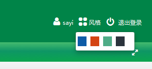

## Spring Theme
Spring主题为系统提供了换肤的功能，通过session或者cookie来实现主题记忆，我们可以自己实现皮肤与用户关联，这通常需要数据存储来记忆主题了。下面我们一步步来实现一个完整的换肤功能，首先浏览一下我们大概需要解决哪些问题：  
> 1. 制作不同主题的样式文件、图片等资源  
> 2. 页面提供切换主题的功能  
> 3. 主题具有记忆功能  
> 4. 切换主题后，页面能使用到相应的主题资源文件

###### 制作不同主题的样式文件、图片等资源
这部分很简单，在资源路径下为不同的样式建立不同的目录，制作不同的样式和图片，我们可以将共有的资源放在共有的目录下，比如如下的目录结构  

        ----resource\
            -- |  common\
            -- |  theme\
                 -- |  classic\
                 -- |  green\
                 -- |  orange\
                 -- |  simple\

制作了这些资源文件之后，Spring需要我们定义这些资源，如同Spring对大多数资源的处理，在默认的目标的WEB-INF\classes下(这个目录当然可以配置，也可以放在任何打包后会编译到classes下的目录，如src)建立主题资源，我们取名称如下：theme-classic.properties、theme-orange.properties等等。里面内容即时一些key对应着资源的路径，这样在页面中就可以引用这些key了：  

    csssayi=resources/themes/classic/css/sayi.css
    cssmain=resources/themes/classic/css/main.css
    datepicker=resources/themes/classic/datePicker/WdatePicker.js
    highcharts=resources/themes/classic/highcharts/js/highcharts.js

    loading-icon=resources/themes/classic/images/loading.gif
    jstree-icon=resources/themes/classic/images/treeicon.png

    edit-png=resources/themes/classic/images/edit.png
    del-png=resources/themes/classic/images/delete.png

###### 页面提供切换主题的功能
Spring接受post或者get请求的以theme为默认名称(当然也可以配置这个名称)的参数，值即为主题名。如 `theme=orange`。页面切换的形式可以任意发挥，比如  
  

###### 主题具有记忆功能
这节就接触到了Spring的主题配置，包括主题资源、主题解析器、主题改变拦截器等。如下配置了主题资源文件前缀和以cookie来记忆主题的解析器。  

<!--?prettify lang=xml?-->
    <bean id="themeSource"
            class="org.springframework.ui.context.support.ResourceBundleThemeSource">
                <property name="basenamePrefix" value="theme-" />
        </bean>
        <bean id="themeResolver"
            class="org.springframework.web.servlet.theme.CookieThemeResolver">
            <property name="cookieName" value="sayi-theme" />
            <property name="defaultThemeName" value="classic" />
    </bean>
我们当然可以通过SessionThemeResolver、FixedThemeResolver来解析当前主题。下面这个拦截器主要就是拦截theme为参数的切换主题的请求，我们当然无需使用Spring这个拦截器，完全可以自己来处理切换主题到解析主题的变换。  

<!--?prettify lang=xml?-->
    <bean id="themeChangeInterceptor"
            class="com.wiscom.idstar.imp.common.theme.ThemeChangeInterceptor">
            <property name="paramName" value="theme" />
            <property name="themes">
                <list>
                    <value>classic</value>
                    <value>orange</value>
                    <value>green</value>
                    <value>simple</value>
                </list>     
            </property>
    </bean>
    <bean class="org.springframework.web.servlet.mvc.method.annotation.RequestMappingHandlerMapping">
            <property name="interceptors">
                <ref bean="themeChangeInterceptor" />
            </property>
    </bean>

###### 切换主题后，页面能使用到相应的主题资源文件
为了使页面能够使用，如前文所说，我们就要使用到资源文件的key值了,引入spring标签,使用 `spring:theme`完成主题的引用，如下代码的href属性的值需要最终能定位到该资源。

    <%@ taglib prefix="spring" uri="http://www.springframework.org/tags" %>
    <link href='/<spring:theme code="csssayi" />' rel="stylesheet" type="text/css" />

## 总结
Spring主题无非是提供了一种获取不同资源文件的便捷切换、记忆方式。但是有时候在调试页面性能的时候会发现主题不能切换，如开启了cache-control、Last-modify等，这已不在本文的范畴。